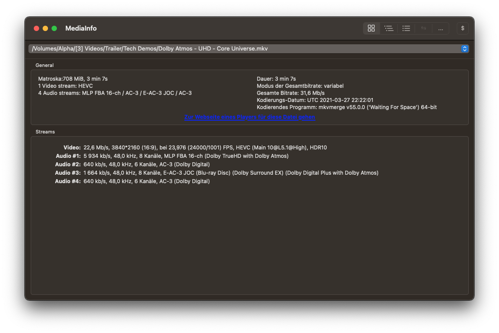

# Versuchsanleitung

## Kurzfassung

In dieser praktischen Übung zum Thema Cloud-Transcodierung soll ein grundlegendes Verständnis für cloudbasierte Transcodierung für Video-on-Demand-Systeme geschaffen werden. Außerdem sollen erste Praxiserfahrungen mit den Cloud-Anbietern AWS und Akamai vermittelt werden.

### Versuche im Überblick

| Nr.                                    | Beschreibung
| -------------------------------------- | -------------------------------------------------------- |
| [Versuch 1](./versuch1/01-einfuehrung) | Grundlegende Konzepte eines **Cloud-Transcoders**        |
| [Versuch 2](./versuch2/01-einfuehrung) | Grundlegende Konzepte eines **CDNs**                     |
| [Versuch 3](./versuch3/01-einfuehrung) | Aufbau eines **automatisierten** VOD-Workflows           |
| [Versuch 4](./versuch4/01-einfuehrung) | **Kommandozeilenbefehle** und **APIs**                   |

## Abgabe

Bewertet wird ein schriftlicher Versuchsbericht sowie die im Laufe der Versuchsdurchführung erzeugten Dateien. Der schriftliche Bericht sollte **grob 3 Seiten pro Versuch** umfassen und neben der Protokollierung der Versuchsdurchführung die in der Versuchsanleitung gestellten Fragen beantworten. 

Die Fragen sind in der Versuchsanleitung folgendermaßen gekennzeichnet:

!!! question "Beispielfrage 1"
    Beispiel-Fragestellung.

### Abgabeort

Die Abgabe des Versuchsberichtes erfolgt via ILIAS. Der Versuchsbericht soll nach dem folgenden Schema benannt sein: 

`[Matrikelnummer] - [Nachname]_[Vorname] - Versuchsbericht.pdf`

Die abzugebenden Dateien sollen in Ihr S3-Bucket hochgeladen werden. Pro Versuch soll für die Abgaben ein eigener Ordner erstellt werden. 

Im Fazit jedes Kapitels sind die Dateien genannt, die mindestens abgegeben werden müssen. Eigene Experimente mit z.B. kreativen Kodiereinstellungen etc. sind erwünscht. Wenn weitere Dateien auf S3 verbleiben, kopieren Sie diese bitte in einen Unterordner "Experimente" und können ebenfalls abgegeben werden.

<u>Beispiel:</u>

```
📁
    📁 Versuch 1
        📄 Clip1_720p.mp4
        ...
    📁 Versuch 2
    📁 Versuch 3
    📁 Versuch 4
    📁 Versuch 5
```

!!! warning "Warnung"
    Dateien, die sich nicht im Abgabeordner befinden, werden bei der Bewertung nicht berücksichtigt.

### Bewertungskriterien

Zur Bewertung werden sowohl der Versuchsbericht, als auch die beantworteten Fragen sowie die abgegebenen Dateien herangezogen. Neben faktischer Korrektheit sollte ebenfalls auf die Rechtschreibung und Form (z.B. Quellenangaben) geachtet werden.

## Benötigte Software

Für die Versuche ist nur wenig Software auf dem lokalen Rechner von Nöten, da auf AWS und Akamai über ein Webinterface zugegriffen wird. Zur Beurteilung der Dateien sind jedoch einige Programme notwendig. 

Alle Programme sind sowohl für Windows und MacOS, als auch für diverse Linux-Distributionen erhältlich.

### Mediaplayer

Zur Wiedergabe von transcodierten Videodateien sollte ein aktueller Mediaplayer vorhanden sein. Empfohlen wird [VLC Mediaplayer](https://www.videolan.org/vlc/index.de.html) oder [mpv](https://mpv.io/).

### MediaInfo

Um die technischen Metadaten der Videodateien auszulesen, wird [MediaInfo](https://mediaarea.net/en/MediaInfo) benötigt.


