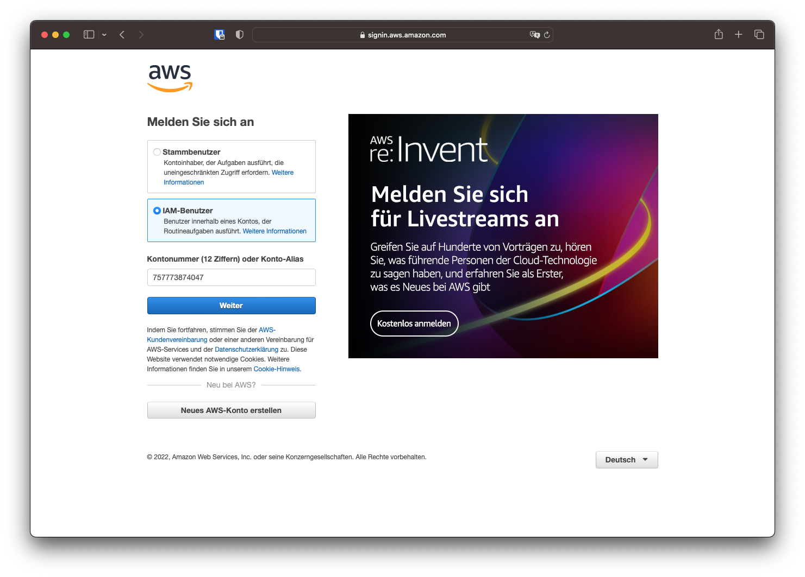
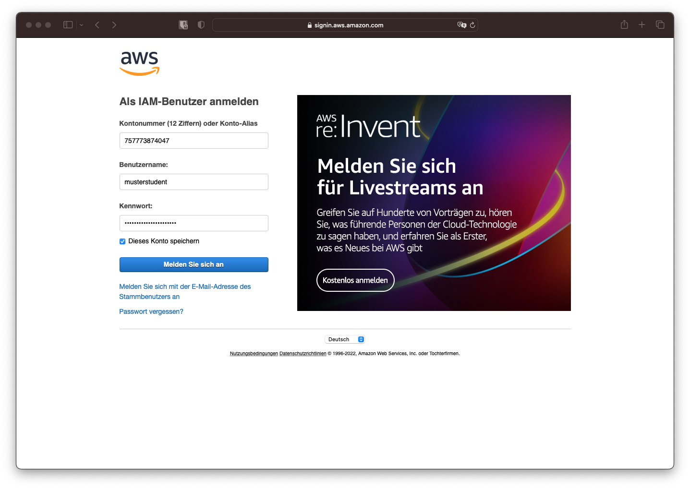
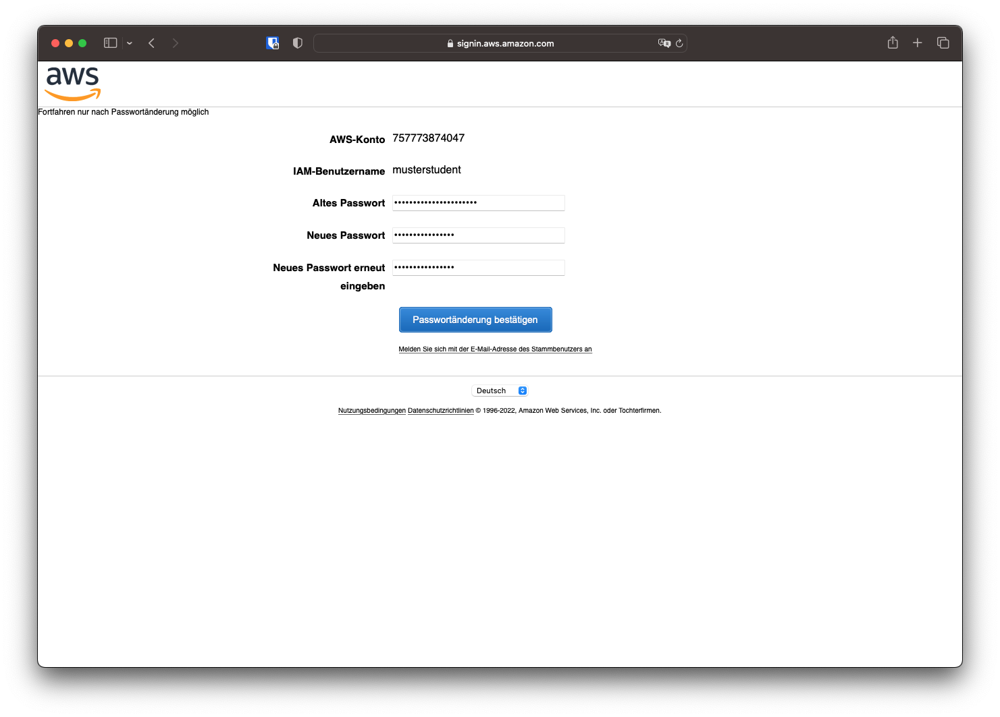
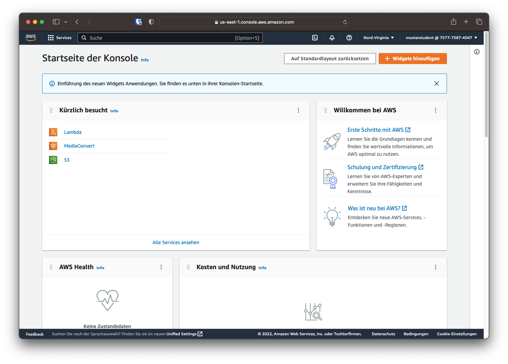
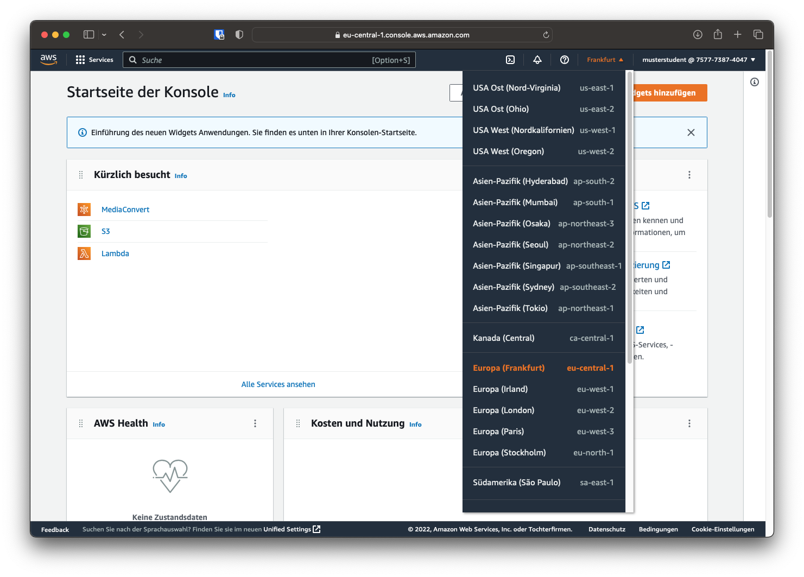

# Einführung

Zuerst werden für diesen Versuch die Grundbegriffe geklärt und das Konzept erläutert. Danach wird mithilfe der Schritt für Schritt Anleitung ein erster Transcodierauftrag erstellt und gestartet. Ziel ist es, nach Versuch 1 ein grundlegendes Verständnis für Cloud-Transcoder zu haben und einen Cloud-Transcoder erstellen zu können.

## Grundbegriffe

### Cloud-Speicher (*AWS S3*)

{ align=left style="height:125px;width:125px" } Cloud-Speicher-Lösungen bieten ähnlich wie die Konsumerprodukte Dropbox, Google Drive etc. Speicherplatz an. Im Industriellen Umfeld wird oft Objektspeicher verwendet, welcher Informationen als Objekte ablegt und nicht wie Dateisysteme in hierarchische Ordnerstrukturen. Jedes Objekt besitz einen global einzigartigen Identifikator und wird in einem Bucket (deutsch: Eimer) gespeichert. 

Als Objektspeicher wird für diesen Versuch *AWS S3* verwendet. Einzelne Objekte können bis zu 5 Terabyte groß sein und entweder über die Web GUI oder über verschiedene APIs hochgeladen werden. Hier werden sowohl die Quelldateien für den Versuch als auch die transcodierten Dateien gespeichert.

!!! warning "Kosten"
    Gespeicherte Dateien verursachen sowohl pro Zeiteinheit Speicherkosten als auch pro übertragene Gigabyte Downloadkosten. Bei kleinen Datenmengen wie in diesen Versuchen belaufen sich die Kosten auf unter 1$ USD. Bei großen Projekten und Datenmengen können die Speicherkosten jedoch deutlich größer sein.

### Transcodierer (*AWS Elemental MediaConvert*)

{ align=left style="height:125px;width:125px;margin-top:0" } Als *Software-as-a-Service* Lösung bieten Cloud-Transcoder für verschiedenste Einsatzzwecke Transcodierungsleistungen, ohne dass sich die Nutzer um Hardware oder Betriebssysteme kümmern müssen.

In diesem Versuch wird *AWS Elemental MediaConvert* verwendet. Nachdem ein Transcodierungsprofil erstellt worden ist, kann die Quelldatei aus dem S3 Objektspeicher gewählt werden und der Codierungsauftrag wird in die Warteschlange eingereiht. Ist die Transcodierung abgeschlossen, wird die transcodierte Datei im Objektspeicher abgelegt.

!!! warning "Kosten"
    Die Kosten pro Transcodierung hängen von Auflösung, Bildrate und Dauer der Quelldatei ab. Pro eine Minute Quellmaterial werden bei HD-Auflösung bspw. ca. 2 Cent USD fällig. So fallen für die Transcodierung eines zweistündigen Filmes ca 2,40$ USD an.

## AWS WebGUI

### Log-in

In diesem Versuch greifen wir auf AWS über die WebGUI zu. Einloggen kann man sich über den Browser auf [aws.amazon.com](https://aws.amazon.com/de/). In der Anmeldemaske kann man zwischen einem *Stammbenutzer* und einem *IAM-Benutzer* wählen. Die Hochschule stellt verwaltete *IAM-Benutzer* zur Verfügung, daher muss diese Option gewählt werden. Die Kontonummer lautet `757773874047`, soweit nicht anders angegeben.

Nach Eingabe der bereitgestellten Kontonummer können auch der Benutzername sowie das Passwort eingegeben und der Log-in bestätigt werden. Das Passwort besteht aus dem Nutzernamen in Kleinbuchstaben, der Matrikelnummer und einem Ausrufezeichen. Für den Nutzer `musterst` mit der Matrikelnummer `12345` würde das Passwort also `musterst12345!` lauten.

Bei der ersten Anmeldung muss das Passwort auf ein Nutzereigenes Passwort geändert werden.

Das Dashboard ist der Startpunkt der AWS-Konsole und bietet die Möglichkeit, verschiedene Widgets anzuzeigen. Oben links lassen sich verschiedene Produkte und Services auswählen. Diese können ebenso über die Suchleiste gefunden werden. 

### Region

Oben rechts kann die Region, also der Standort des verwendeten Rechenzentrums, verändert werden. Für die Versuche ist die Nächstgelegende Region in diesem Fall *Frankfurt (`eu-central-1`)*, die sinnvollste.

!!! question "Frage 1"
    Eine Region beschreibt kein einzelnes Rechenzentrum. Recherchieren und erläutern Sie die Begriffe "Region" und "Availability Zone". Wie sind Regionen und Availability Zones miteinander verbunden?

