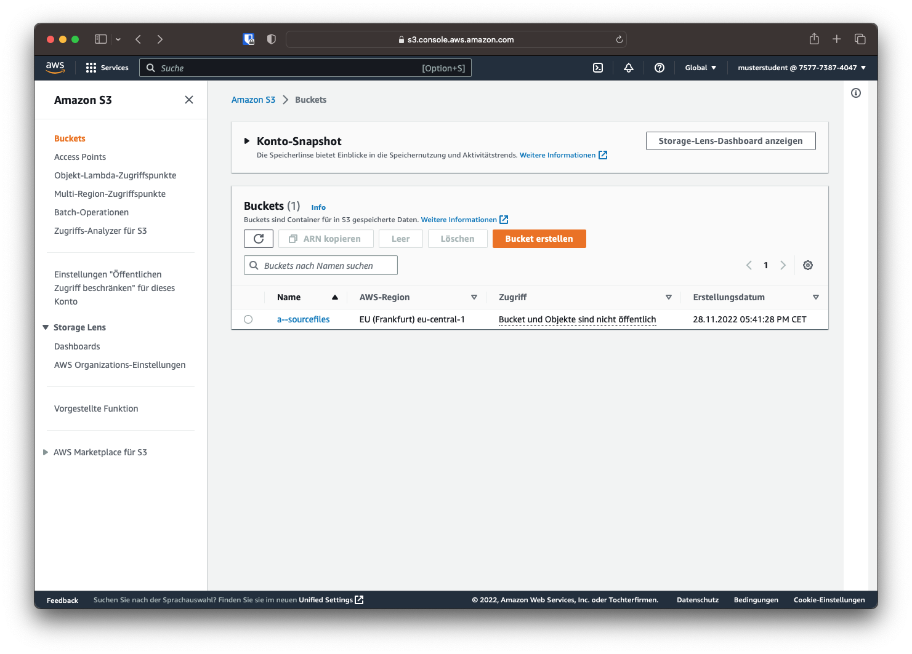
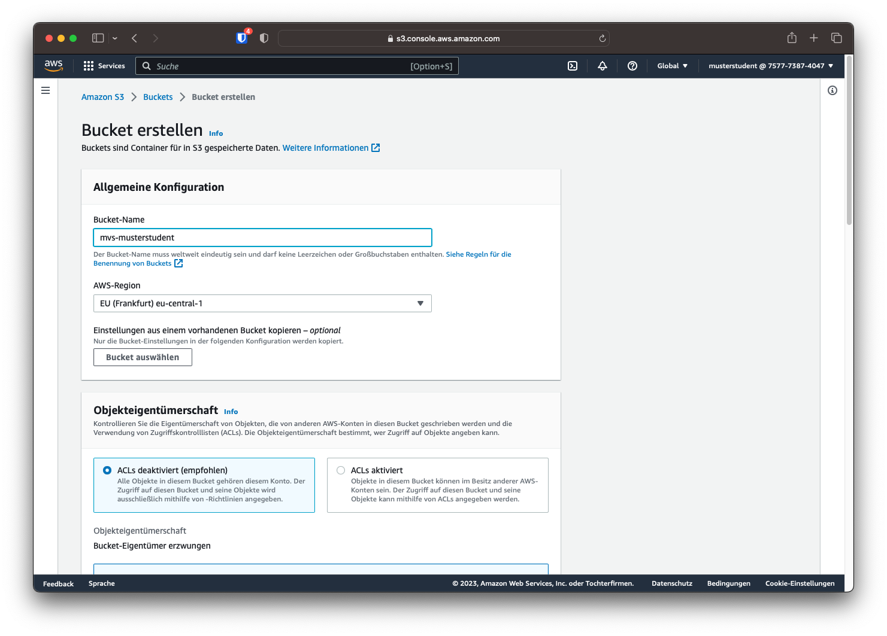
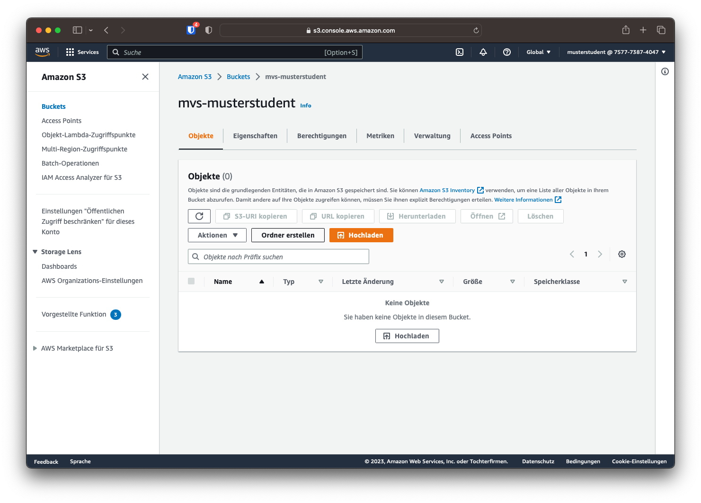
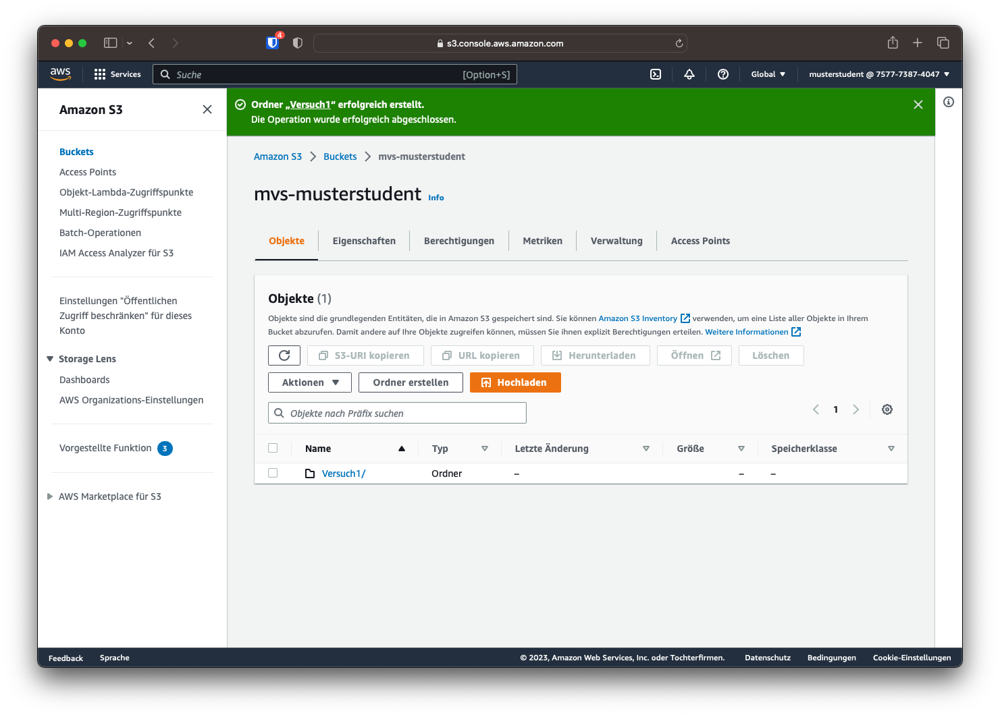
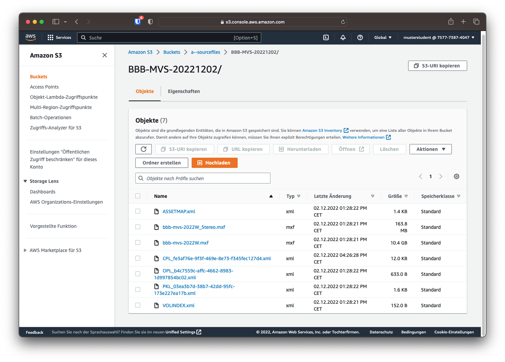

# AWS S3

Zuerst muss der Speicherort für die transcodierten Dateien erstellt werden. Dafür wird der S3 Objektspeicher verwendet. Auf der AWS Konsole lässt sich S3 oben links unter `Services -> Speicherung -> S3` auswählen oder über die Suchleiste finden.

!!! question "Frage 2"
    Welche Redundanzen und welche Zuverlässigkeit bietet S3-Objektspeicher laut Amazon? Was ist der Unterschied zwischen der Verfügbarkeit des S3-Services und der Verfügbarkeit eines einzelnen Objektes über ein Jahr?

Über die Seitenleiste lässt sich die Option `Buckets` auswählen. Hier werden die von diesem Konto erstellten Buckets, also Speicherorte, angezeigt. Dies schließt auch jene ein, die von einem anderen IAM-Benutzer mit der gleichen Konto-ID erstellt wurden. Daher werden auch die Buckets der anderen Studierenden gelistet, obwohl die Benutzer der Studierenden nur Zugriff auf den eigenen Bucket haben.

## Bucket erstellen

Mithilfe des Buttons *"Bucket erstellen"* kann ein neuer Bucket erstellt werden. Der Bucket soll nach dem Schema `mvs-[HDS-Nutzername]` benannt werden, also beispielsweise `mvs-musterstudent`. Als AWS-Region soll Frankfurt (`eu-central-1`) gewählt werden. Alle anderen Einstellungen können auf ihren Standardeinstellungen belassen werden. Mit dem Button *"Bucket erstellen"* wird der angegeben Bucket erstellt.

!!! info
    Der Name des Buckets muss weltweit eindeutig gewählt sein und darf keine Leerzeichen, Großbuchstaben oder Unterstriche enthalten.

Der neu erstellte Bucket solle nun in der Auflistung aller Buckets angezeigt werden.

## Unterordner erstellen

!!! info
    Das Prinzip der Objektspeicher sieht keine klassischen Ordner, wie sie in einem hierarchischen Dateisystem zu finden sind, vor. Um trotzdem Struktur in einen Bucket zu bringen, kann über Präfixe der Form `foldername/file.extension` eine hierarchische Dateistruktur simuliert werden. In der AWS-Konsole werden diese Präfixe getrennt mit einem `/` wie ein hierarchisches Dateisystem angezeigt. Der Einfachheit halber werden diese Präfixe im Folgenden als *Ordner* bezeichnet.

Für die transcodierten Dateien soll ein Unterordner im Bucket erstellt werden. Dazu muss der Bucket durch das Klicken auf den Bucketnamen in der Übersicht aller Buckets geöffnet werden. Hier kann nun über die Schaltfläche *"Ordner erstellen"* ein Ordner im Bucket erstellt werden.

Als Name soll `Versuch1` gewählt werden. Ist der Ordner erstellt, wird dieser in der Übersicht des Buckets angezeigt.

## Quelldateien

Die Quelldateien, die für den Transcodier-Auftrag verwendet werden sollen, wurden bereits auf S3 hochgeladen und liegen im Bucket `a--sourcefiles/IMFs`. Sie liegen im MXF Format und in einer hohen Bitrate vor, wie es auch bei professionellen Produktionen der Fall ist.

