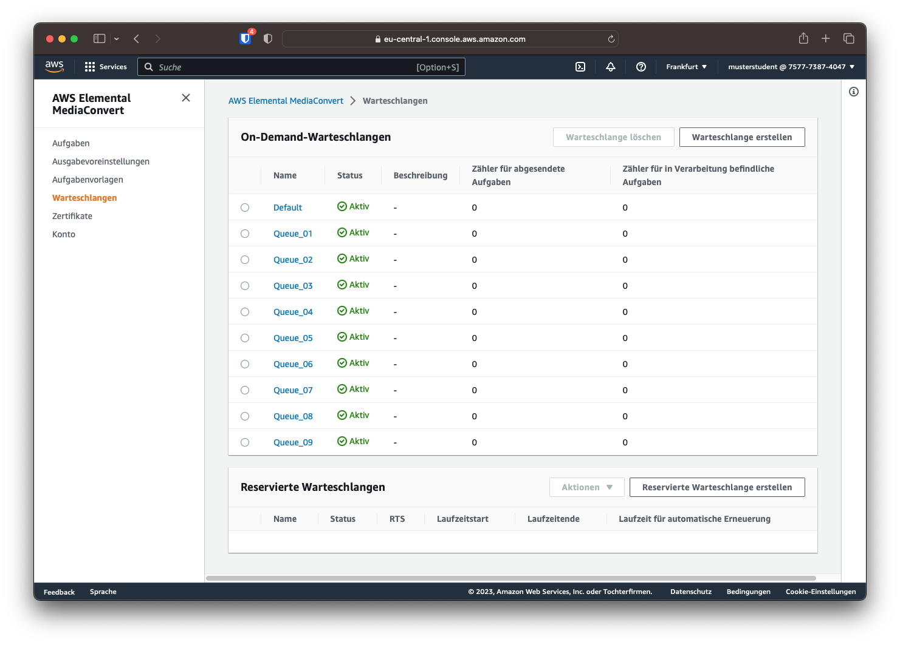

# AWS MediaConvert

Um das Sample-Video zu transcodieren, wird AWS Elemental MediaConvert verwendet. Dieser Service ist unter `Services -> Media Services -> MediaConvert` zu finden. Mit dem Klick auf *"Erste Schritte"* kann ein Transcoder-Auftrag erstellt werden. 

Vorher sollte jedoch sicher gestellt werden, dass man sich in der Region Frankfurt (eu-central-1) befindet.

## Warteschlange

Da auch bei MediaConvert die Aufträge von anderen IAM-Benutzern angezeigt werden, lohnt sich der Übersicht halber die Einordnung in Warteschlangen. Der Bereich "Warteschlangen" lässt sich über die Seitenleiste aufrufen.

Hier wurden bereits die maximale Anzahl von 10 Warteschlangen erstellt. Welche Warteschlange genutzt werden soll, wurde in der Mail mit den Zugangsdaten mitgeteilt.

## Transcodierauftrag erstellen

Um eine Videodatei in ein anderes Format zu transcodieren, muss ein Transcodierauftrag (Transcoding Job)  erstellt werden. Hier werden unter anderem die Transcodierparameter sowie der Ein- und Ausgabepfad festgelegt.

!!! warning "Achtung!"
    Der orangene Button "Erstellen" am unteren Ende der Seite erstellt und startet den Transcoding Job. Ist der Transcoding Job erstellt, können dessen Einstellungen nicht mehr geändert werden und es muss ein neuer Job mit den veränderten Einstellungen erstellt werden.

    **Klicken Sie daher erst auf "Erstellen", wenn alle Transcodiereinstellungen (das sind die folgenden Abschnitte Eingabe, Ausgabe, Berechtigungen und Rollen, Warteschlange) festgelegt sind!**

### Eingabe

Zuerst muss die Quelldatei bestimmt werden. Im Feld der Eingabedatei-URL kann manuell eine öffentliche S3-, HTTP- oder HTTPS-URL angegeben werden oder durch die Schaltfläche *Durchsuchen* eine Datei in den eigenen S3-Buckets ausgewählt werden. 

Da die Quelldateien bereits im Bucket `a--sourcefiles` abgelegt wurden, kann dieser durch den Button "Durchsuchen" ausgewählt werden. Sobald man das Suchfeld "Datei" auswählt, werden die verfügbaren Dateien angezeigt. Hier muss die Composition Playlist (CPL) ausgewählt werden, damit MediaConvert die Quelldaten als MXF einlesen kann. Für diesen ersten Versuch soll die CPL-Datei aus dem Ordner `IMFs/BBB-MVS-20221202/` gewählt werden.

Falls die Quelldatei vom Transcoder anders als in den Metadaten vermerkt interpretiert werden soll, kann diese Auswahl ebenfalls im Bereich *Eingaben* getroffen werden. Für diesen Versuch müssen diese Einstellungen jedoch nicht verändert werden.

### Ausgabe

Im Bereich *Ausgabegruppen* kann ein oder mehrere Ausgabeformate festgelegt werden. Für diesen Versuch soll die Option *Dateigruppe* gewählt werden, da einzelne Ausgabedateien erzeugt werden sollen.

Im Reiter *File Group* lässt sich nun unter anderem eine Zieladresse auswählen. Hier wählen wir den im letzten Kapitel angelegten S3-Ordner `Versuch1` im eigenen S3-Bucket.

Für diesen Versuch soll die Quelldatei in folgende Formate transcodiert werden:

| Auflösung | Video Bitrate | Audio Bitrate | Namensmodifikator |
| --------- | ------------- | ------------- | ----------------- |
| 1920x1080 | 5 Mbit/s      | 192 Kbit/s    | `_1080p`          |
| 1280x720  | 2,5 Mbit/s    | 128 Kbit/s    | `_720p`           |
| 848x480   | 1 Mbit/s      | 96 Kbit/s     | `_480p`           |

Dafür können über den Button "Ausgabe hinzufügen" mehrere Ausgaben erstellt werden und Namensmodifikatoren vergeben werden. Diese Modifikatoren werden an den Dateinamen der transcodierten Dateien angehängt.

#### Videoformat

Durch das Klicken auf den Namen der jeweiligen Ausgabe (z.B. *"Output 1"*) werden die Codierungseinstellungen der jeweiligen Ausgabe geöffnet. Hier kann nun die gewünschte Auflösung sowie der gewünschte Modus der Bitrate und die dazugehörigen Parameter eingestellt werden. Für alle Ausgaben soll eine feste Bitrate (CBR) verwendet werden.

Die Parameter Auflösung und Bitrate können aus der vorangegangenen Tabelle entnommen werden. Die Qualitätsoptimierungsebene soll auf "HQ mit einem Durchgang" gestellt werden.

!!! warning
    Die Bitrate wird bei AWS in Bit/s und nicht in **M**bit/s angegeben. Eine Umrechnung ist notwendig.

#### Timecode

Bei den erstellten Dateien soll der Timecode als Wasserzeichen in das Video "eingebrannt", also fest in das Video codiert werden. Dafür muss in den Videocodier-Einstellungen ganz unten der Bereich "Vorverarbeitung" ausgeklappt und die Option "Timecode einbrennen" aktiviert werden. Die Bemerkung "Pro" neben der Option signalisiert, dass sich durch das Aktivieren der Option die Transcodiergebühren erhöhen.

Als Präfix soll der eigene HDS-Nutzername mit einem Bindestrich gewählt (also `musterstudent - `) werden, sodass `musterstudent - 00:00:00:00` im oberen Bereich des Bildes zu sehen ist. Als Schriftgröße soll "Small" gewählt werden. Die Position soll nicht verändert werden. 

#### Audioformat

Durch die Auswahl *"Audio 1"* statt "Video" kann auch die Audiocodierung verändert werden. Standardmäßig wird "Fortgeschrittene Audiocodierung" (Advanced Audio Coding / AAC) verwendet, es können jedoch auch verschiedene Dolby-Codecs ausgewählt werden.

Hier muss nur die Audiobitrate anhand der Tabelle eingestellt werden. Soll ein anderes Format als Stereo verwendet werden, kann dies ebenfalls hier konfiguriert werden.

### Berechtigungen und Rolle

Berechtigungen und Rollen in AWS sind ein komplexeres Thema, das vor allem in Versuch 3 wichtig wird. Für diesen Versuch ist nur wichtig, dass die richtige Rolle für den Transcodierauftrag gewählt wird. Dazu wählt man im linken Menü den Punkt "AWS-Integration" und kontrolliert, ob die "MediaConvert_Default_Role" ausgewählt ist.

### Warteschlange

Als letzter Schritt muss im Menüpunkt "Aufgabenverwaltung" noch die eigene Warteschlange ausgewählt werden. Danach kann über den Button "Erstellen" der Transcodierauftrag erstellt und gestartet werden. Welche Warteschlange genutzt werden soll, steht in der Mail mit den Zugangsdaten, die jeder Studierende bekommen haben sollte.

## Überwachung des Transcodierauftrages

Ist der Auftrag erstellt, erfolgt eine Weiterleitung auf die "Aufgabenübersicht" des erstellten Auftrags, in der der aktuelle Stand des Auftrags angezeigt wird. Ist der Auftrag eingegangen, wird `SUBMITTED` im Status angezeigt. Die Aufgabenübersicht wird nicht automatisch aktualisiert und muss daher manuell über den Button "Aktualisieren" auf den aktuellen Stand gebracht werden.

!!! question "Frage 3"
    Wie lange dauerte der Transcodiervorgang?

Wird der Auftrag bearbeitet, lautet der Status `PROGRESSING`.

Ist der Auftrag erledigt, wird der Status `COMPLETE` angezeigt.

Der Job kann auch in der Übersicht der Aufgaben angezeigt werden. Hier kann nach der Warteschlange gefiltert werden, um eine übersichtliche Darstellung zu generieren.

