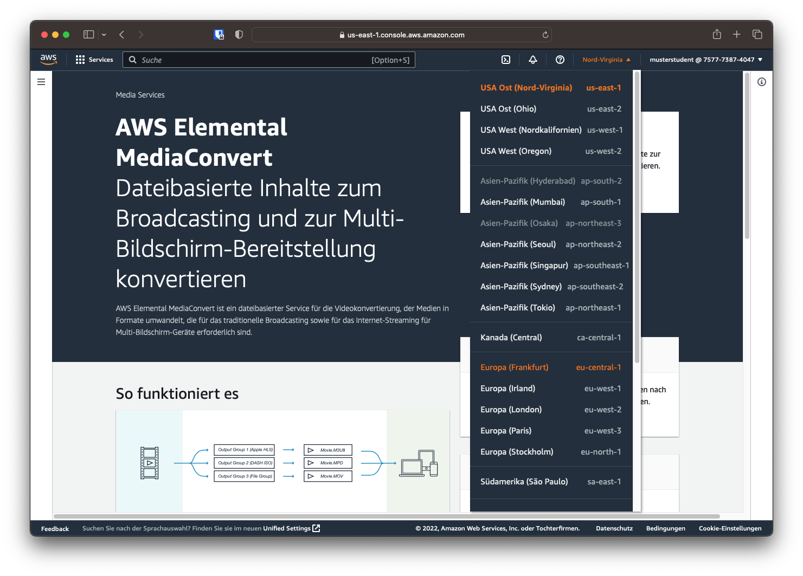
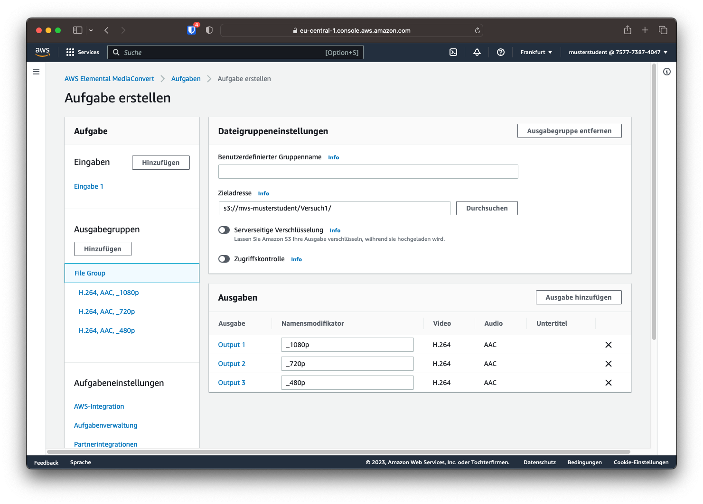
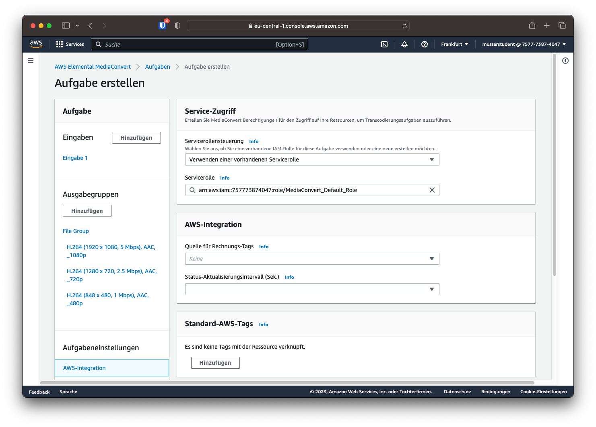
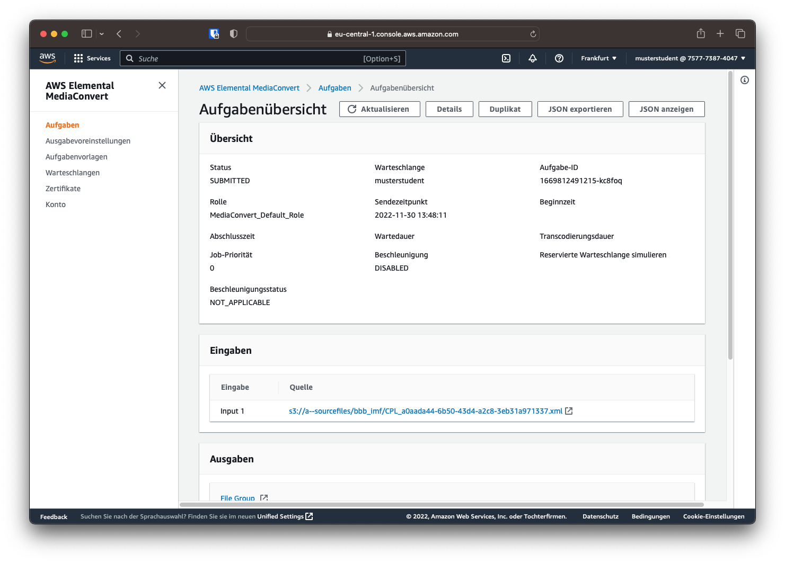
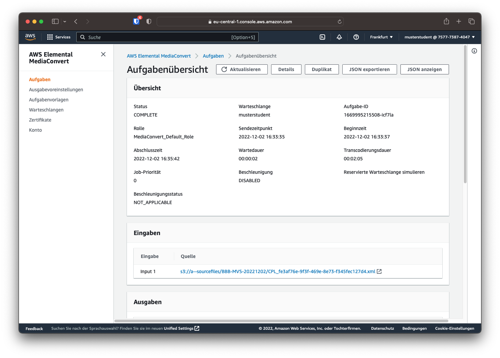

# AWS MediaConvert

Um das Sample-Video zu transkodieren wird AWS Elemental MediaConvert verwendet. Dieser Service ist unter `Services -> Media Services -> MediaConvert` zu finden. Mit dem Klick auf *"Erste Schritte"* kann ein Transkoder-Auftrag erstellt werden. 

Vorher sollte jedoch sicher gestellt werden, dass man sich in der Region Frankfurt (eu-central-1) befindet.

## Warteschlange

Da auch bei MediaConvert die Aufträge von anderen IAM-Benutzern angezeigt werden, lohnt sich der Übersicht halber eine eigene Warteschlange. Der Bereich "Warteschlangen" lässt sich über die Seitenleiste aufrufen.

Hier lässt sich über die Schaltfläche "Warteschlange erstellen" eine eigene Warteschlange erstellen. Als Name soll der Nutzername verwendet werden.

## Transkodierauftrag erstellen

Um eine Videodatei in ein anderes Format zu transkodieren muss ein Transkodierauftrag erstellt werden. Hier werden unter anderem die Transkodierparameter sowie der Ein- und Ausgabepfad festgelegt.

### Eingabe

Zuerst muss die Quelldateien bestimmt werden. Im Feld der Eingabedatei-URL kann manuell eine öffentliche S3-, HTTP- oder HTTPS-URL angegeben werden oder durch die Schaltfläche *Durchsuchen* eine Datei in den eigenen S3-Buckets ausgewählt werden. 

Da die Quelldateien bereits im Bucket `a--sourcefiles` abgelegt wurden, kann dieser durch den Button "Durchsuchen" ausgewählt werden. Sobald man das Suchfeld "Datei" auswählt, werden die verfügbaren Dateien angezeigt. Hier muss die Composition Playlist (CPL) ausgewählt werden, damit MediaConvert die Quelldaten als MXF einlesen kann.

Falls die Quelldatei vom Transkoder anders als in den Metadaten vermerkt interpretiert werden soll, kann diese Auswahl ebenfalls im Bereich *Eingaben* getroffen werden. Für diesen Versuch müssen diese Einstellungen jedoch nicht verändert werden.

### Ausgabe

Im Bereich *Ausgabegruppen* kann ein oder mehrere Ausgabeformate festgelegt werden. Für diesen Versuch soll die Option *Dateigruppe* gewählt werden, da ein einzelne Ausgabedateien erzeugt werden sollen.

Im Reiter *"File Group"* lässt sich nun unter anderem eine Zieladresse auswählen. Hier wählen wir den im letzten Kapitel angelegten S3-Bucket.

Für diesen Versuch soll die Quelldatei in folgende Formate transkodiert werden:

| Auflösung | maximale Bitrate | Audio Bitrate | Namensmodifikator |
| --------- | ---------------- | ------------- | ----------------- |
| 1920x1080 | 8.000 Mbit/s     | 192 Kbit/s    | `_1080p`          |
| 1280x720  | 3.000 Mbit/s     | 128 Kbit/s    | `_720p`           |
| 848x480   | 1.500 Mbit/s     | 96 Kbit/s     | `_480p`           |

Dafür können über den Button "Ausgabe hinzufügen" mehrere Ausgaben erstellt werden und Namensmodifikatoren vergeben werden. Diese Modifikatoren werden an den Dateinamen der transkodierten Dateien angehängt.

#### Videoformat

Durch das Klicken auf den Namen der jeweiligen Ausgabe (z.B. *"Output 1"*), werden die Kodierungseinstellungen der jeweilgen Ausgabe geöffnet. Hier kann nun die gewünschte Auflösung, sowie der gewünschte Modus der Bitrate und die dazugehörigen Parameter eingestellt werden. Für alle Ausgaben soll eine qualitätsdefinierte variable Bitrate (QVBR) verwendet werden. Hierbei wird die Bitrate der Komplexität der Szene zum aktuellen Zeitpunkt angepasst. Können also z.B. einheitliche Flächen gut komprimiert werden, wird die Bitrate bei gleichbleibender Qualität gesenkt. Die maximale Bitrate kann ebenso definiert werden, wie die gewünschte Qualitätsstufe.

Die Parameter Auflösung und maximale Bitrate können aus der vorangegangenen Tabelle entnommen werden. Die Qualitätsstufe soll auf 8 gestellt werden. Außerdem soll die Qualitätsoptimierungsebene auf "HQ mit einem Durchgang" gestellt werden.

!!! warning
    Die Maximale Bitrate wird bei AWS in Bit/s und nicht in **M**bit/s angegeben. Eine Umrechnung ist notwendig.

#### Audioformat

Durch die Auswahl *"Audio 1"* statt "Video" kann auch die Audiokodierung verändert werden. Standardmäßig wird "Fortgeschrittene Audiocodierung" (Advanced Audio Coding / AAC) verwendet, es können jedoch auch verschiedene Dolby-Codecs ausgewählt werden.

Hier muss nur die Audio Bitrate anhand der Tabelle eingestellt werden. Soll ein anderes Format als Stereo verwendet werden, kann dies ebenfalls hier konfiguriert werden.

### Berechtigungen und Rolle

Berechtigungen und Rollen in AWS sind ein komplexeres Thema, das vor allem in Versuch 3 wichtig wird. Für diesen Versuch ist nur wichtig, dass die richtige Rolle für den Transkodierauftrag gewählt wird. Dazu wählt man im linken Menu den Punkt "AWS-Integration" und kontrolliert, ob die "MediaConvert_Default_Role" ausgewählt ist.

### Warteshlange

Als letzter Schritt muss im Menupunkt "Aufgabenverwaltung" noch die eigene Warteschlange ausgewählt werden. Danach kann über den Button "Erstellen" der Transkodingauftrag erstellt und gestartet werden.

## Überwachung des Transkodierauftrages

Ist der Auftrag erstellt, erfolgt eine Weiterleitung auf die "Aufgabenübersicht" des erstellten Auftrags, in der der aktuelle Stand des Auftrags angezeigt wird. Ist der Auftrag eingegangen, wird `SUBMITTED` im Status angezeigt. Die Aufgabenübersicht wird nicht automatisch aktualisiert und muss daher manuell über den Button "Aktualisieren" auf den aktuellen Stand gebracht werden.

!!! question "Frage 3"
    Wie lange dauerte der Transcodiervorgang?

Wird der Auftrag bearbeitet, lautet der Status `PROGRESSING`.

Ist der Auftrag erledigt, wird der Status `COMPLETE` angezeigt.

Der Job kann auch in der Übersicht der Aufgaben angezeigt werden. Hier kann nach der Warteschlange gefiltert werden, um eine übersichtliche Darstellung zu generieren.

