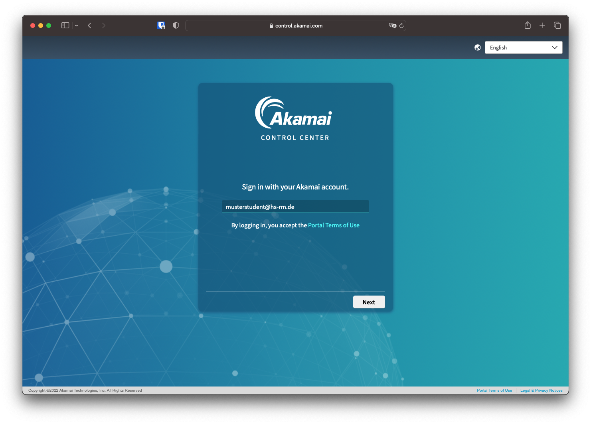
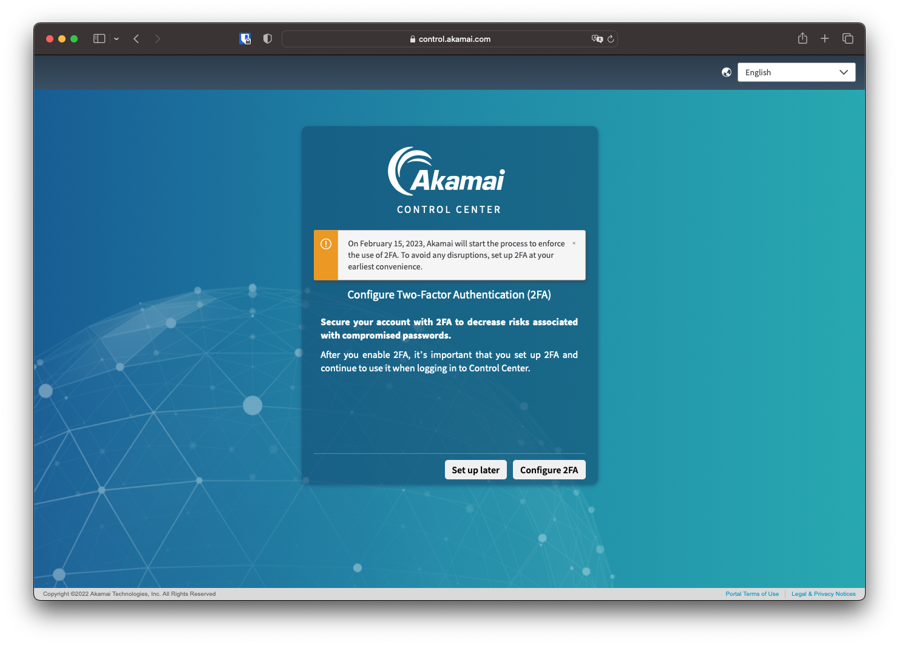

# Einführung

In Versuch 2 wird vor allem auf das CDN eingegangen. Die Verteilung der transcodierten Mediendateien steht im Vordergrund. Auf die tiefer gehende Theorie von CDNs wird nicht mehr eingegangen. 

## Grundbegriffe

Als CDN-Anbieter wird Akamai genutzt. Akamai ist einer der global größten Anbieter für Content Delivery Networks und war 2015 für 15 - 30% des weltweiten Datenverkehrs im Internet verantwortlich[^1].

[^1]: https://de.wikipedia.org/wiki/Akamai

Ebenso wie AWS lässt sich Akamai über eine [Weboberfläche](https://control.akamai.com) oder die API bedienen. In diesem Versuch wird die Weboberfläche genutzt.

!!! warning "Kosten"
    Wie auch bei AWS werden die Kosten anhand des Aufwandes berechnet. Beim CDN entstehen die meisten Kosten durch die Datenmenge, die summiert an Nutzer übertragen wurde. Für den Versuch wurde uns ein freies Kontingent von 2 Petabyte zur Verfügung gestellt.

### Akamai Adaptive Media Delivery (*AMD*)

Zur Verteilung von streambaren Mediendateien hat Akamai das Produkt "Adaptive Media Delivery" im Portfolio. Dabei wird das CDN auf die Anforderungen, die beim Streamen von Audio und Video entstehen, konfiguriert und es können spezifisch auf Mediendateien zugeschnittene Einstellungen angepasst werden.

### Akamai NetStorage

Die im CDN zu verteilenden Daten müssen von einem sogenannten Origin-Server eingelesen werden. Dies kann ein externer Speicheranbieter wie AWS sein oder es wird der Akamai-Interne Dienst NetStorage genutzt. Auf NetStorage können beispielsweise via ftp, ssh oder rsync Daten hochgeladen werden und so dem CDN zur Verfügung gestellt werden.

### Property

Als Property bezeichnet Akamai eine Konfigurationsdatei, die steuert, wie das CDN auf Anfragen reagieren soll. Pro Property können ein oder mehrere Hostnamen hinterlegt werden.

### Hostnamen

Damit ein Mediaplayer auf die im CDN gespeicherten Medien zugreifen kann, müssen URLs bzw. Hostnamen, wie z.B. `cdn.netflix.com` bereitgestellt werden. Akamai unterscheidet hier zwischen dem Property Hostname und dem Edge Hostname. 

#### Property Hostname

Im Normalfall ist der Property Hostname die Adresse der eigenen Domain, unter dem die Medien verfügbar sein sollen. Im Falle des ZDFs könnte dies `cdn.zdf.de` sein. Für diesen Versuch steht keine eigene Domain zu Verfügung, weswegen wir als Property Hostname auch eine Domain von Akamai nutzen.

#### Edge Hostname

Der Edge Hostname ist das Äquivalent zum Property Hostname aufseiten von Akamai. Dieser könnte z.B. lauten `zdf.akamaized.net`. In der Praxis verweist der DNS-Eintrag des Property Hostname auf den Edge Hostname und die Daten können abgerufen werden.

{ style="width:100%" }
{ style="width:100%" }

## Akamai WebGUI

### Login

Die Akamai WebGUI lässt sich über den Browser auf [control.akamai.com](https://control.akamai.com) aufrufen. Vor Beginn des Versuchs sollte eine Informationsmail mit den Schritten zu einem Passwort angekommen sein. Über die Funktion "Passwort vergessen" lässt sich ein eigenes Passwort vergeben.

!!! warning "Sicherheit"
    Akamai verlangt die Nutzung von Multi-Faktor-Authentifizierung. Bitet wählen Sie eines der angebotenen 2FA-Verfahren.

    

Nach dem Login landet man auf dem Akamai Control Center Dashboard.
