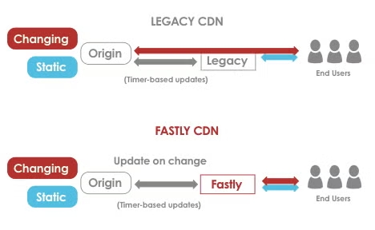

# Einführung

In Versuch 2 wird vor allem auf das CDN eingegangen. Die Verteilung der transcodierten Mediendateien steht im Vordergrund. 

## Grundbegriffe

Als CDN-Anbieter wird Fastly genutzt. Fastly ist ein US-amerikanischer Anbieter für Content Delivery Networks.

[^1]: https://de.wikipedia.org/wiki/Fastly

Ebenso wie AWS lässt sich Fastly über eine [Weboberfläche](https://manage.fastly.com) oder eine API bedienen. In diesem Versuch wird die Weboberfläche genutzt.

### Fastly CDN Service

Zur Auslieferung von statischen sowie streambaren Mediendateien nutzt Fastly
sogenannte **Services**.  
Fastly bietet Compute Services und CDN Services an.
In der praktischen Übung nutzen wir nur den CDN Service.
Ein CDN Service stellt die zentrale Konfigurationseinheit des CDNs dar und definiert,
wie Fastly auf eingehende Anfragen reagieren soll.

Innerhalb eines CDN Services werden unter anderem folgende Aspekte konfiguriert:

- der Origin-Server
- das Caching-Verhalten
- die Hostnamen, unter denen Inhalte erreichbar sind

### Origin

Die im CDN zu verteilenden Mediendateien werden von einem sogenannten
**Origin-Server** bezogen.  
Als Origin kann sowohl ein externer Speicheranbieter wie **AWS S3** als auch ein
eigener Webserver dienen.

In diesem Versuch wird ein AWS-S3-Bucket als Origin verwendet.  
Fastly greift bei der ersten Anfrage auf den Origin zu und speichert die
angeforderten Inhalte anschließend im Cache, sodass sie bei weiteren Zugriffen
direkt über das CDN ausgeliefert werden können.

### Service Domain

Damit Medieninhalte im CDN bereitgestellt werden können, stellt
Fastly für jeden Service eine sogenannte **Service Domain** zur Verfügung.  

Im oberen Teil der Abbildung ist ein Legacy-CDN dargestellt. Änderungen an den Inhalten erfolgen am Origin-Server, werden jedoch nur zeitbasiert (z. B. über feste Cache-Invalidierungsintervalle) an die CDN-Knoten weitergegeben. Dadurch kann es zu Verzögerungen kommen, bis aktualisierte Inhalte bei den Endnutzern verfügbar sind.

Der untere Teil der Abbildung zeigt den Fastly-CDN-Ansatz. Hier werden Änderungen am Origin unmittelbar erkannt und ereignisbasiert („update on change“) an das CDN übertragen. Aktualisierte Inhalte stehen dadurch nahezu in Echtzeit an den Edge-Servern zur Verfügung und können ohne lange Wartezeiten an die Endnutzer ausgeliefert werden
