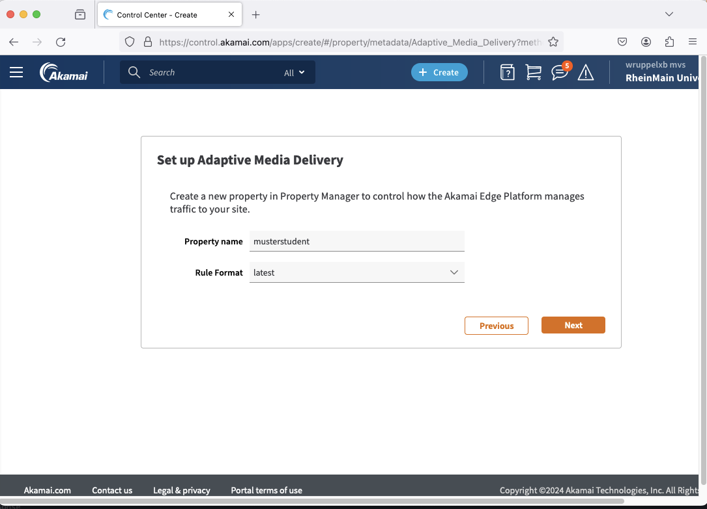

# Property

Jeder Student erstellt eine eigene Property, also die Konfigdatei, in der beschrieben wird, wie das CDN auf Anfragen reagieren soll. Dazu wird in der Seitenleiste `CDN -> Properties` gewählt.

Auf dem Dashboard werden alle vorhandenen Properties angezeigt.

## Name

Zum Erstellen einer neuen Property, muss rechts auf "New Property" geklickt werden. Zuerst muss das gewünschte CDN-Produkt gewählt werden. Da Medien verteilt werden sollen, muss hier "Adaptive Media Delivery" gewählt werden. Dies sollte die einzige Option sein.

Danach kann der Name der Property festgelegt werden. Hier soll der HDS-Anmeldenamen (z.B. `faschmab`) gewählt werden.

## Konfiguration

Ist der Name bestätigt, werden die tiefer gehende Konfiguration festgelegt. Zuerst müssen Hostnamen hinzugefügt werden.

### Hostnamen

Im Bereich "Property Hostnames" muss auf den Button "+ Hostnames" geklickt werden und die Option "Add Instant Config Hostname" gewählt werden.

!!! info
    Üblicherweise steht für die Konfiguration eine eigene Domain bzw. Subdomain wie `cdn.eigene-website.de` zur Verfügung. In diesem Fall müsste der Punkt "Add Hostname(s)" gewählt werden. Im Zuge dessen kann ein Akamai-Interner Hostname gewählt werden und der eigene Hostname eingegeben werden.

    Da für diesen Versuch keine eigene Domain zur Verfügung steht, wird mit der Option "Add Instant Config Hostname" ein Akamai Hostname für beide Hostnames genutzt.

Im erschienenen Fenster soll nun der Edge Hostname auf den HDS-Anmeldenamen (z.B. `faschmab`) gesetzt werden. Der Hostname hat damit die Struktur `[username].mdc.akamaized.net`. Die IP-Version muss nicht verändert werden. Als Segmented Media Mode soll "VOD" gewählt werden.

Mit dem Klick auf "Confirm" wird der Hostname angelegt.

### Settings

Die Property Configuration Settings legen fest, wie das CDN auf Anfragen reagiert. Wie eine Firewall werden die erstellten Regeln nacheinander abgearbeitet. Trifft eine Regel zu, wird mit der Anfrage wie in dieser Regel definiert verfahren und der Prozess ist abgeschlossen. 

Im Falle von Akamai durchläuft eine Anfrage die Regeln von unten nach oben. Sollen verschieden Medien oder Live und VOD über die gleiche Property verteilt werden, kann dies mit mehreren Regeln gelöst werden. Für diesen Versuch benötigen wir lediglich die automatisch erstellte "Default Rule". Diese wird in den folgenden Schritten modifiziert.

#### Origin Server

Als Erstes muss der Origin Server festgelegt werden. Hier soll der schon bestehende NetStorage Account "MVS2" gewählt werden.

#### Content Provider Code

Der Content Provider Code erleichtert das Abrechnen der Kosten, wenn viele verschiedene CDNs und Produkte genutzt werden. Für diesen Versuch wurde bereits ein CP-Code erstellt (`1640181 - mvs-upload`). Dieser kann aus der Liste gewählt werden.

#### Origin Location

Da der NetStorage Origin Server in Europa konfiguriert wurde, muss im Bereich "Origin Characteristics" die Einstellung "Origin Location" auf "Europe" gesetzt werden.

#### Content Characteristics

Im Bereich Content Characteristics kann das CDN individuell auf die verwendeten Medien eingestellt werden. Da in diesem Versuch sowohl die Anzahl der Clips sehr gering ist (im Vergleich zu kommerziellen Anbietern) soll die Katalog-Größe auf "Small" gestellt werden. Der Content Type kann bei "High Definition" belassen werden. Die Protokolle HDS, DASH und Smooth sollen deaktiviert werden, da die verwendeten Clips in HLS vorliegen.

{ style="max-width:80%" }

!!! question "Frage 1"
    Recherchieren Sie, welche Firmen oder Standardisierungsgremien hinter den verschiedenen Streaming-Protokollen stehen. Welche Protokolle sind heute noch relevant? Nennen Sie beispielhaft einen Streaming-Anbieter und welches Protokoll dieser nutzt. (Quelle angeben)

#### Origin Base Path

Zuletzt soll noch eine neue Eigenschaft zu der Regel hinzugefügt werden. Ganz unten über den Button "+ Behavior" kann dies getan werden.

Hier soll die Eigenschaft "Origin Base Path" hinzugefügt werden.

Ist die neue Eigenschaft hinzugefügt, soll im Feld "Base Path" der HDS-Nutzername umrahmt von zwei Schrägstrichen eingetragen. 

!!! question "Frage 2"
    Welchen Effekt hat diese zusätzliche Eigenschaft?

### Speichern

Um die Einstellungen der Property zu speichern, wird der Button "Save" genutzt. Im Gegensatz zu AWS MediaConvert wird die erstellte Konfiguration nicht direkt ausgeführt, sondern muss erst aktiviert werden.

!!! info
    Soll zu einem späteren Zeitpunkt eine aktivierte Property-Einstellung verändert werden, muss jedoch eine neue Version dieser Property-Einstellung erstellt werden. Dafür wird der Button "Edit New Version" genutzt und die Versionsnummer der Einstellung wird erhöht. Die geänderte Konfiguration muss danach erst aktiviert werden, um einen Effekt zu haben.

## Aktivierung

Damit die erstellte Konfiguration an das CDN weitergegeben wird, muss diese aktiviert werden. Dazu wählt man den Reiter "Activate" aus.

Es kann zwischen der Aktivierung im "Staging Network" und im "Production Network" gewählt werden. Das "Staging Network" ist ein eigenes CDN mit angepassten Hostnamen, um Änderungen erst einmal testen zu können, bevor die Änderungen auf alle Nutzer angewendet werden. So können Fehler in der Konfiguration behoben werden, bevor es zu Ausfällen bei Nutzern kommt. Das "Production Network" ist das reguläre CDN über welches Nutzer die Medienstreams abrufen.

Im Normalfall sollte die Konfiguration erst im Staging Network getestet werden. Da dies jedoch weitergehende Konfiguration zum Testen erfordert, soll ausnahmsweise die Konfiguration direkt im Produktionsnetz aktiviert werden. 

Dazu klickt man auf "Activate v1 on Production" und aktiviert den Haken, der vor der Aktivierung im Produktionsnetz vor dem Staging-Netz warnt.

Ist die Aktivierung im Gange, wird eine Fortschrittsanzeige im Reiter "Activate" angezeigt.

Der Vorgang der Aktivierung im Produktionsnetz dauert ca. 10 Minuten.

!!! question "Frage 3"
    Warum dauert die Propertyaktivierung eine so lange Zeit?

Während die Aktivierung im Hintergrund durchgeführt wird, kann die Konfiguration der Testwerkzeuge vorgenommen werden.
