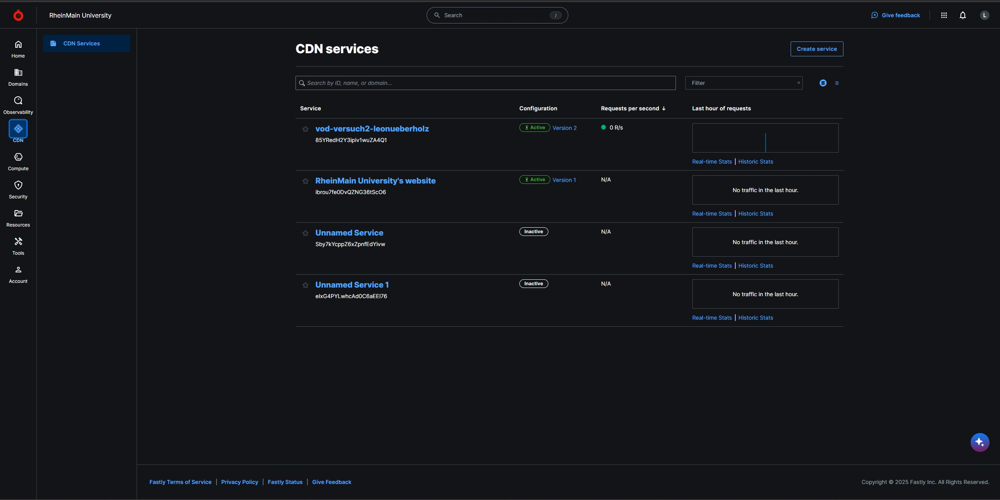
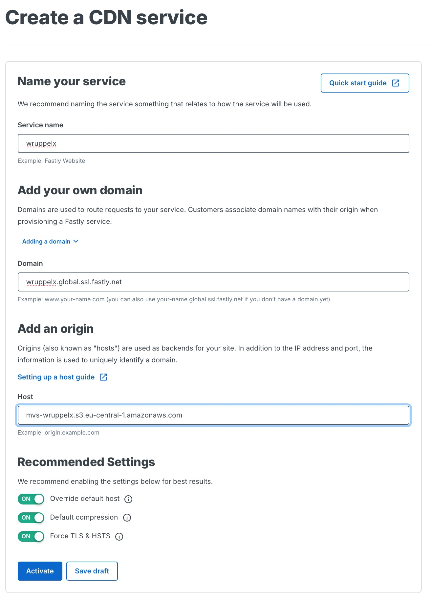
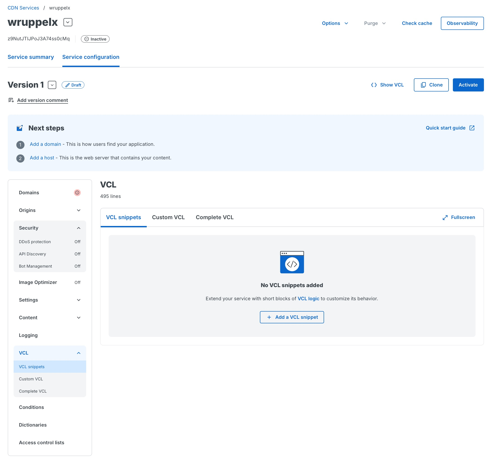
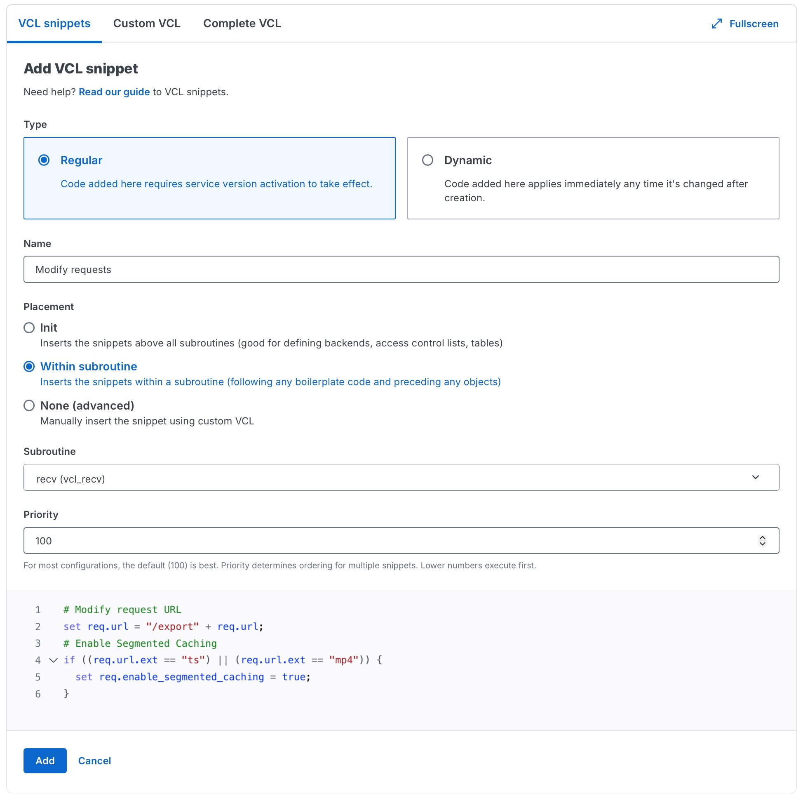

# Service

Jeder Studierende erstellt einen eigenen **Fastly Service**.  
Ein Service beschreibt die vollständige Konfiguration des CDNs und legt fest,
wie Fastly auf eingehende Anfragen reagiert und von welchem Origin Inhalte
abgerufen werden.

## Service anlegen

Nach dem Login in das Fastly Dashboard wird in der linken Seitenleiste der Punkt  
**CDN → CDN Services** ausgewählt.

Auf der Übersichtsseite werden alle vorhandenen Services angezeigt.

Zum Erstellen eines neuen Services wird rechts oben auf **Create service**
geklickt.



## Service konfigurieren
Füllen Sie die Felder in der unten gezeigten Maske aus, drücken Sie anschließend "Save draft" (noch nicht "Activate"!)
Erläuterungen siehe unten.




### Name your service

In diesem Feld wird der Name des Services festgelegt.  
Als Name soll der **HDS-Nutzername also der Name mit dem Sie sich bei StudIP auch anmelden** verwendet werden (z. B. `lelugoue`).

Der Name dient ausschließlich der internen Zuordnung und hat keinen Einfluss
auf die später verwendete Domain.


### Add your own domain

In diesem Feld müssen die Domains definiert werden, unter denen die Inhalte
über das CDN erreichbar sind.

Jeder Studierende erhält eine eigene Domain von Fastly. 

Die Domain `global.ssl.fastly.net` wird von Fastly bereitgestellt,

**Verwenden Sie als Hostnamen wiederum Ihren HDS-Nutzernamen.**


**Beispiel:**
```bash
mmustera.global.ssl.fastly.net
```

Diese Domain wird später zur Auslieferung der Mediendateien genutzt.


### Add an origin

Als nächstes muss der **Origin-Server** konfiguriert werden.  
Der Origin ist die Quelle, von der Fastly die Mediendateien bezieht, falls diese
noch nicht im Cache vorhanden sind.

In diesem Versuch wird Ihr in Versuch 1 angelegtes **AWS-S3-Bucket** als Origin verwendet.

**Namensschema:**
```bash
mvs-[HDS-Nutzername].s3.eu-central-1.amazonaws.com
```

### Save draft 
Bitet speichern Sie den CDN Service mit `Save draft` zur weiteren Bearbeitung.


## VCL Anpassung 1 von 3: Segmentiertes Caching aktivieren

Bei der Auslieferung großer Videodateien aus dem STACKIT Object Storage über Fastly stößt die Standardkonfiguration schnell an Grenzen. Für neue Fastly-Accounts dürfen Objekte ohne Zusatzfunktionen nur bis zu einer Größe von 20 MB im Cache gespeichert werden. Das verwendete Testvideo (testvideo.mp4) ist deutlich größer, weshalb ein normaler Cache-Zugriff zu einer Fehlermeldung („Response object too large“) führt.

Um solche Dateien trotzdem performant über das CDN ausliefern zu können, bietet Fastly Segmented Caching an. Dabei wird das Video nicht als einzelne große Datei im Cache abgelegt, sondern in kleinere Abschnitte zerlegt. Diese Segmente lassen sich unabhängig voneinander zwischenspeichern und bei Bedarf wieder zusammensetzen. Das passt gut zu typischen Videoabrufen, da moderne Mediaplayer Inhalte ohnehin in Form von Byte-Range-Anfragen anfordern.

Segmented Caching ist standardmäßig nicht aktiv und muss gezielt konfiguriert werden.

Navigieren Sie unter **Service configuration** /  **LOGGING** zu dem Reiter Snippets




Klicken Sie **Add a VCL snippet**

Übergeben Sie auf der Einrichtungsmaske folgende Parameter:

**Name:** Enable segmented caching

**Placement:** Within subroutine

**Subroutine:** recv(vcl_recv)

**Priority:** 100

```bash
# Modify request URL
set req.url = "/export" + req.url;
# Enable Segmented Caching
if ((req.url.ext == "ts") || (req.url.ext == "mp4")) {
  set req.enable_segmented_caching = true;
}
```

!!! question "Frage 2.1"
    Erläutern Sie den obenstehenden Code. Erläutern Sie auch, was Segmented Caching ist.





Beenden Sie die Eingabe mit **Add**

## VCL Anpassung 2 von 4: Zugriff auf Ihr AWS S3 Bucket einrichten

Ihr AWS S3 Bucket ist defaultmäßig gegen Zugriff aus dem Internet geschützt.
Um Fastly den Zugriff zu ermöglichen muss eine weitere VCL-Anpassung vorgenommen werden.
Folgen Sie dazu der Anleitung unter

https://www.fastly.com/documentation/guides/integrations/non-fastly-services/amazon-s3/#using-an-amazon-s3-private-bucket 


Legen Sie wie dort beschrieben ein Snippet in der Subroutine `miss` an.

Verwenden Sie den Access Key, bestehend aus `AWS_ACCESS_KEY` und `AWS_SECRET_KEY`, den Sie in Versuch 1 erzeugt haben.

Beenden Sie die Eingabe mit **Add**

Hinweis: Das ebenfalls dort beschriebene Snippet `Strip AWS response headers` bitte nicht anlegen.

!!! question "Frage 2.2"
    Sie könnten alternativ Ihr S3 Bucket auch über eine AWS-Policy öffentlich zugänglich machen. 
    Die obige Konfiguration der Zugangsdaten in Fastly zum Zugriff auf die Origin-Daten wäre dann nicht erforderlich.
    Welchen Unterschied macht dies aus Sicherheitsgründen? Welche Kosten könnten entstehen?


## Anpassung 3 von 3: 

Cross-origin resource sharing (CORS) ist für die Stream-Analyse mit einem HLS-Player erforderlic.

Aktivieren Sie CORS in den Einstellungen Ihres Service wie im folgenden beschrieben:

https://www.fastly.com/documentation/guides/full-site-delivery/headers/enabling-cross-origin-resource-sharing/

Übernehmen Sie dabei alle Einstellungen wie unter "5. Create header" beschrieben.

## Aktivierung

Überprüfen Sie, ob beide VCL snippets angelegt wurden.


Aktivieren Sie dann Ihren CDN Service durch Klicken auf **Activate**.

Nach der Aktivierung ist der Service aktiv und die Inhalte können über die
zugewiesene Domain abgerufen werden.


### Edge Hostname

Der Edge Hostname bezeichnet den von Fastly bereitgestellten Hostnamen, über den Inhalte über das CDN ausgeliefert werden.
Er dient als technischer Endpunkt, über den Anfragen an die Edge-Server von Fastly gestellt werden und über den die Mediendateien abgerufen werden können.

!!! info
    In der Praxis verweist üblicherweise ein DNS-Eintrag einer eigenen Domain oder Subdomain auf diesen Edge Hostnamen.
    Da für diesen Versuch keine eigene Domain zur Verfügung steht, erfolgt der Zugriff direkt über den von Fastly bereitgestellten Edge Hostnamen.

### Settings / Konfigurationslogik

ie Service-Konfiguration legt fest, wie Fastly auf eingehende Anfragen reagiert.

Für diesen Versuch wird ausschließlich die automatisch angelegte Default Configuration verwendet und gezielt angepasst.
Weitere Regeln sind nicht erforderlich, da ausschließlich VOD-Inhalte (HLS) ausgeliefert werden.


