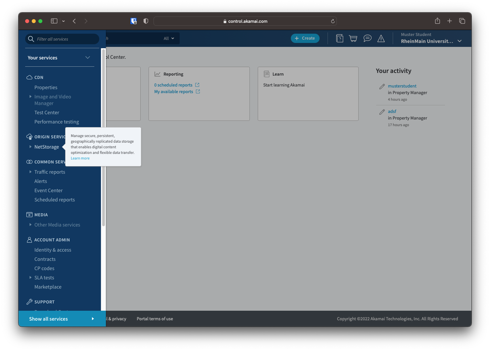
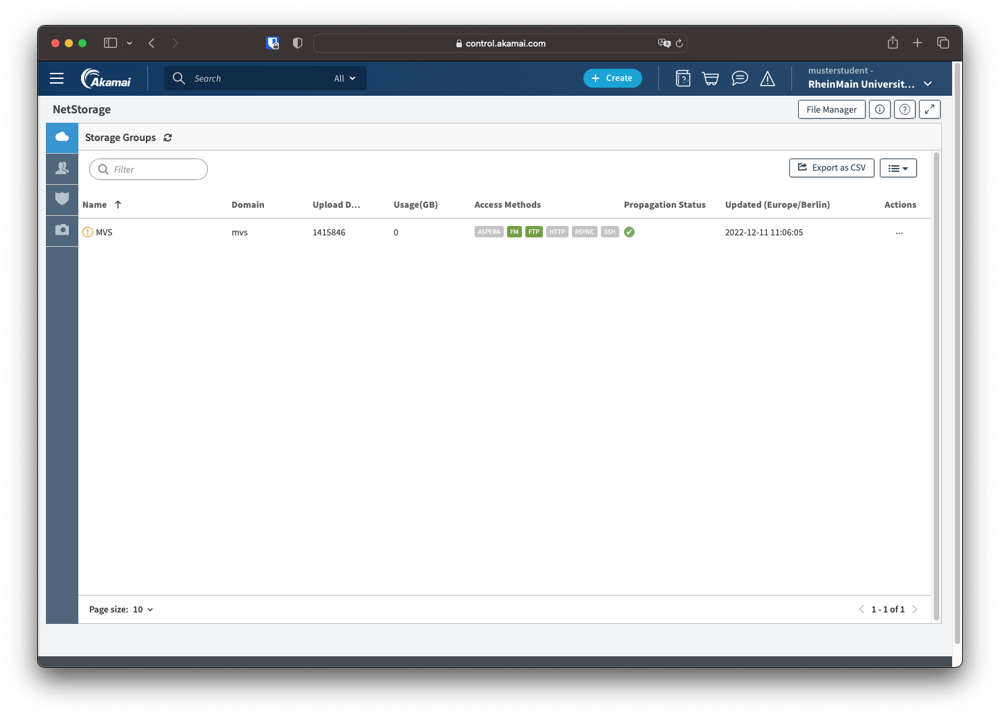
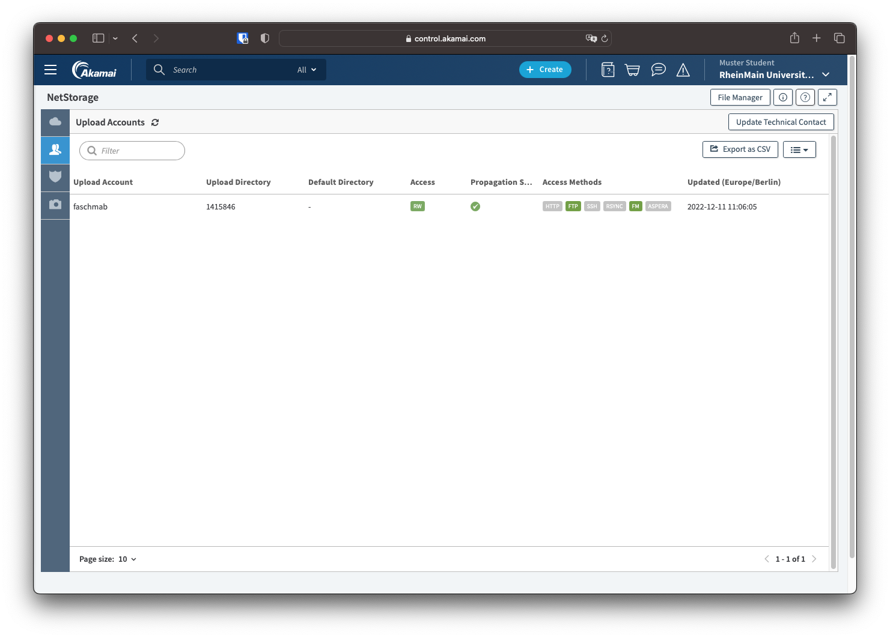
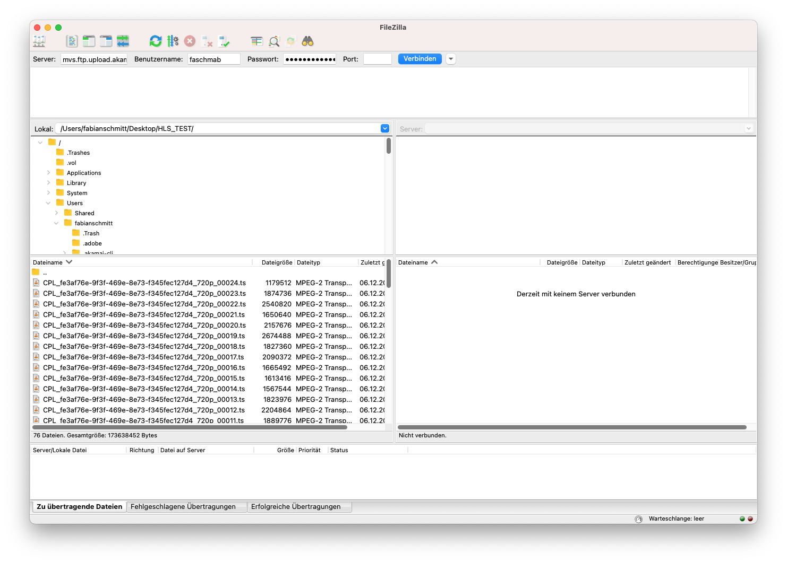

# NetStorage

Wie in den Property-Einstellungen schon festgelegt, sollen die Quelldaten von einem NetStorage Origin Server abgerufen werden. Für jeden Teilnehmenden an der AWS-Übung steht ein eigene Ordner zur Verfügung.  Für Versuch 2 wurde bereits ein HLS-Clip  auf NetStorage hochgeladen. 
Eigene Daten können nach Belieben hinzugefügt werden. (Hinweis: In Versuch 3 Werden Sie dann über AWS MediaConvert erzeugte Streaming-Inhalte automatisiert auf NetStorage kopieren).

## Zugriff

Auf NetStorage kann auf verschiedenen Wegen zugegriffen werden. Darunter sind unter Andrem `rsync`, `ssh` oder `HTTP`. Für diesen Versuch wird jedoch `ftp` genutzt.

Zur NetStorage Übersicht gelangt man über die Seitenleiste unter `Origin Services -> NetStorage`.

Auf der Startseite werden die verfügbaren "Storage Groups" angezeigt. Diese sind in ihrer Funktion mit Buckets bei AWS zu vergleichen. In der Spalte "Access Methods" werden die verfügbaren Zugriffsmethoden für die Storage Groups angezeigt.

Durch einen Klick auf das Personen-Symbol in der linken Leiste werden die verfügbaren Upload Accounts angezeigt. Für jeden Teilnehmer des Praktikums ist ein eigener Nutzer erstellt.

## FileZilla

Um auf den Origin Server via ftp zuzugreifen, wird ein FTP-Client benötigt. Dafür empfiehlt sich FileZilla. Dieser kann [hier](https://filezilla-project.org/download.php?show_all=1) heruntergeladen werden. Sollte keine dauerhafte Installation gewünscht sein, kann die Windows-Datei ohne "setup" im Namen heruntergeladen und entpackt werden.

In der oberen Leiste kann der Server sowie Nutzername und Passwort eingetragen werden. Der Nutzername ist der eigene HDS-Nutzername und das Passwort setzt sich wie beim AWS-Login auch aus Nutzername, Matrikelnummer und Ausrufezeichen (z.B. `musterst12345!`) zusammen.

Der linke Bereich ist das lokale Dateisystem. Hier können die Dateien, die hochgeladen werden sollen, ausgewählt werden und per Drag-and-Drop auf die andere Seite verschobene werden.

Im rechten Bereich befindet sich das Dateisystem auf der Serverseite.

Der Fortschritt der Übertragung wird im unteren Bereich angezeigt.

!!! question "Frage 4"
    Dokumentieren Sie, welche Manifest-Dateien (*.m3u8) für den gesamten Clip sowie die einzelnen Qualitätsstufen bereits in Ihrem Ordner vorhanden sind.

