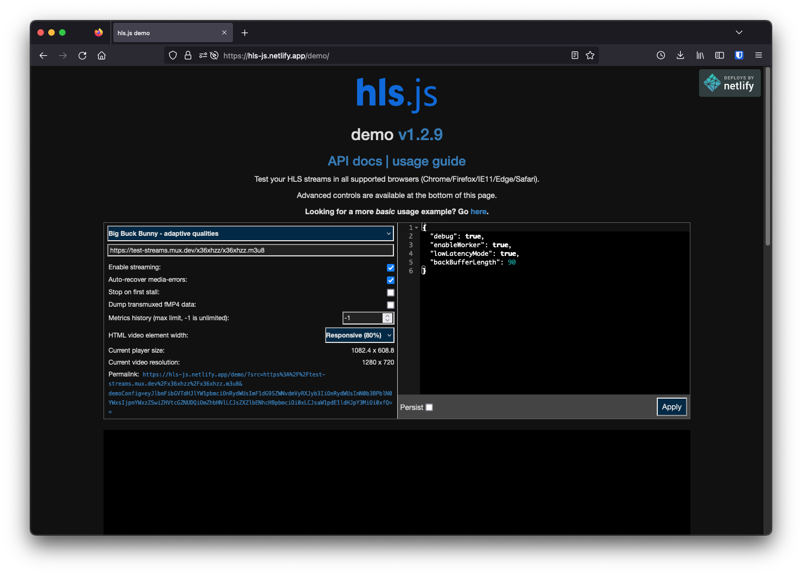
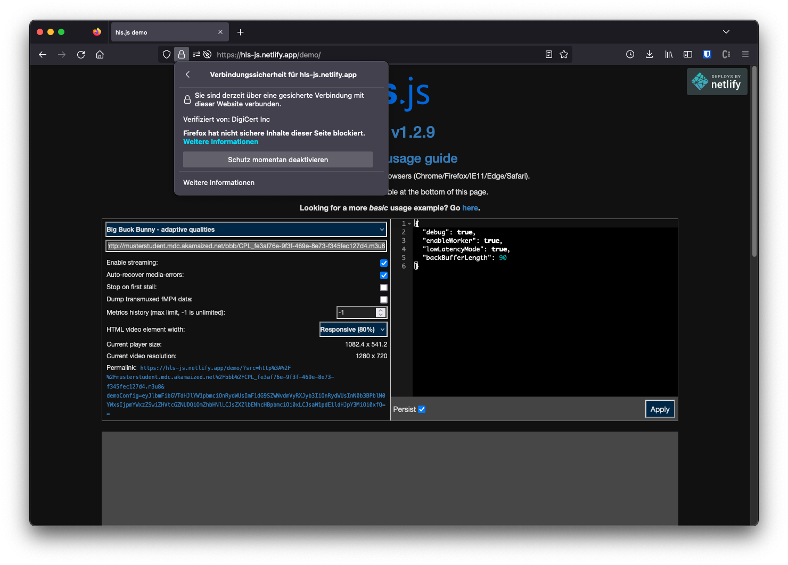
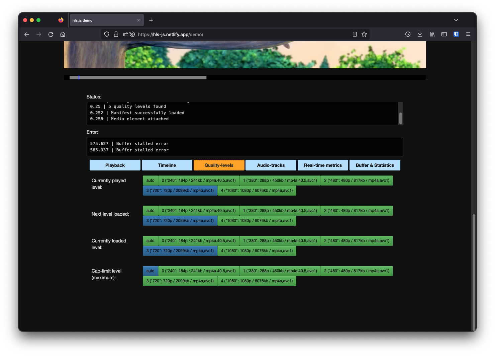
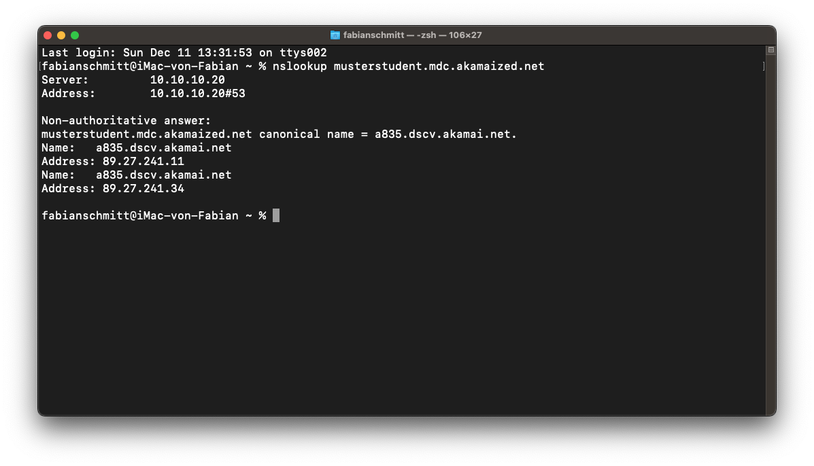
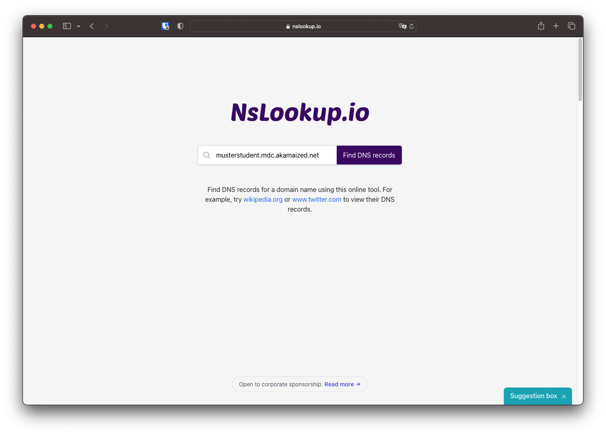
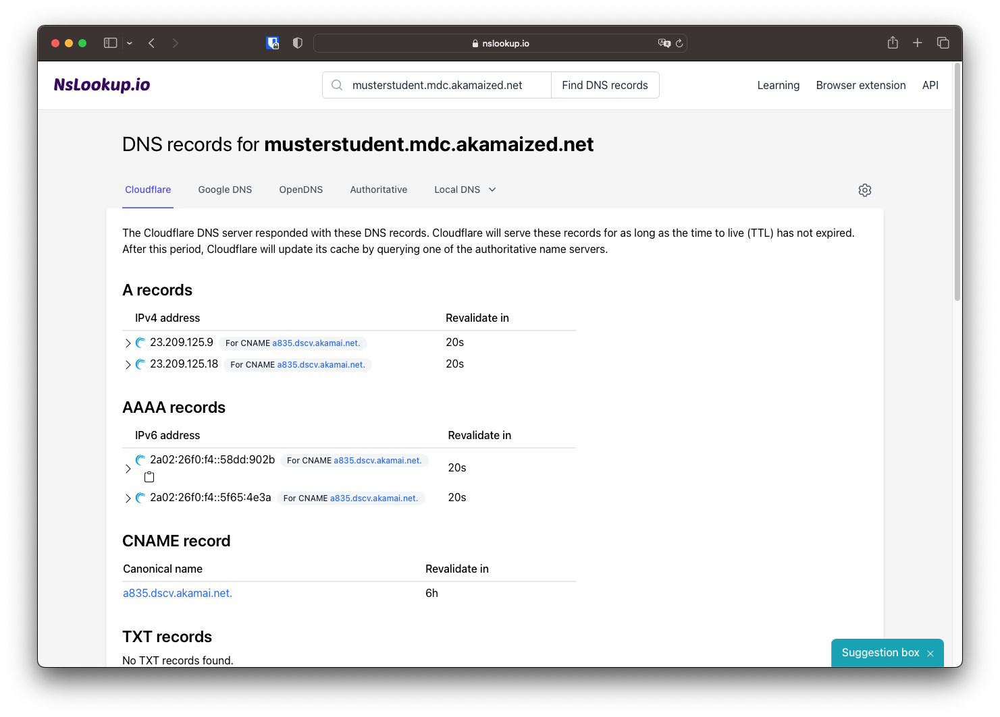
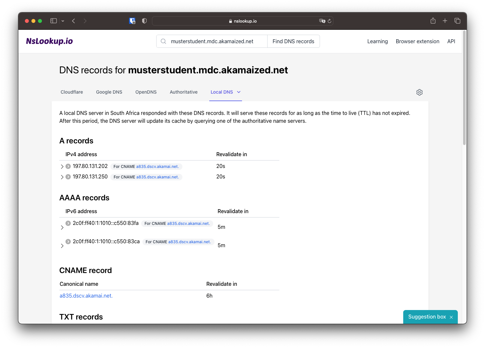

# Inhalte Abrufen

Die Inhalte sind nun über das CDN erreichbar. Der HLS-Stream kann damit öffentlich abgerufen werden. Um die Funktion des CDNs zu testen, soll im ersten Schritt kontrolliert werden, dass der HLS-Stream ordnungsgemäß abgerufen und in verschiedenen Qualitätsstufen wiedergegeben werden kann. Im zweiten Schritt soll kontrolliert werden, dass je nach geografischer Lage ein passender Edge Server im CDN gewählt wird und der DNS Eintrag auf diesen verweist.

## HLS-Player

Zum Testen der HLS-Funktionalität soll die Demo-Instanz von hls.js genutzt werden. hls.js ist eine quelloffene JavaScript Bibliothek, die HLS-Streams im Browser wiedergeben kann. Der Demoplayer ist unter [https://hlsjs.video-dev.org/demo/](https://hlsjs.video-dev.org/demo/) zu finden.

!!! warning "Kompatibilität"
    Auf meinem Mac konnte die Seite via Safari zwar geladen werden, das Video konnte aber nicht gestartet werden. Auf anderen HLS-Playern trat das gleiche Problem auf. Über den Firefox Browser funktionierte es jedoch problemlos.

    Sollten auch bei Ihnen Probleme auftreten löst ein andere Browser unter Umständen das Problem.




Standardmäßig ist in der Wiedergabe-URL ein Testvideo eingetragen. Hier soll die Akamai-URL der `.m3u8`-Datei ohne ein Qualitätssufix wie `_720p` eingetragen werden. Die URL besteht aus der Basis-URL (`http://username.mdc.akamaized.net/`) und dem Pfad zur entsprechenden HLS-Playlist-Datei (z.B. `ftp_source/playlist.m3u8`).

!!! warning "Kompatibilität"
    Denken Sie daran, den Ordner, in der sich die Playlist-Datei befindet, auch mit anzugeben.

### HTTP und HTTPS

Da wir keine eigene Domain für das CDN nutzen, wird auch ein Akamai-Eigenes HTTPS Zertifikat genutzt. Dieses wird von Firefox als "Nicht sicher" markiert und verhindert das Laden im HLS-Player. Daher muss die URL mit einem http angegeben werden. Sie sollte circa dieser Form entsprechen:

```
http://musterstudent.mdc.akamaized.net/bbb/CPL_xxxxx.m3u8
```

Das Laden von HTTP Inhalten auf einer HTTPS Website ist standardmäßig deaktiviert. Dies lässt sich jedoch temporär überbrücken. Am einfachsten ist dies mithilfe von Firefox möglich: [https://support.mozilla.org/en-US/kb/mixed-content-blocking-firefox](https://support.mozilla.org/en-US/kb/mixed-content-blocking-firefox)

Dazu wurf man den HLS-Player auf, gibt den Link zur Playlist ein und drückt enter. Danach klickt man auf das Schloss in der URL-Leiste in Firefox. Danach klickt man auf "Verbindung ist sicher" und klickt auf "Schutz momentan deaktiveren"



### Abspielen

Mithilfe der Schaltflächen unter dem Abspielfenster können die Qualitätsstufen des Streams gewählt werden und Echtzeit-Statistiken des Video-Streams angezeigt werden



!!! question "Frage 5"
    Welche Qualitätsstufen sind im HLS-Stream enthalten? Geben Sie jeweils die vertikale Auflösung an.

## DNS

### nslookup

Zuerst soll die Namensauflösung innerhalb der Hochschule getestet werden. Dafür muss die Kommandozeile geöffnet werden und der Befehl `nslookup` ausgeführt werden. Als Argument des Befehls muss der Akamai Hostname angehängt werden, damit der Befehl folgender Struktur folgt:

```
nslookup musterstudent.mdc.akamaized.net
```



Im oberen Bereich wird der verwendete DNS-Server angezeigt. Dies ist in meinem Fall ein lokaler DNS-Server. Darunter werden die IP-Adressen zu dem aufgelösten Hostnamen angezeigt.

!!! question "Frage 6"
    Führen Sie den Befehl in der Hochschule aus. Fügen Sie einen Screenshot der Ausgabe in ihrem Versuchsbericht ein. Recherchieren Sie mithilfe einer GeoIP Webseite (z.B. [https://www.maxmind.com/en/geoip-demo](https://www.maxmind.com/en/geoip-demo)) den ungefähren Standort und Betreiber der gelisteten IP-Adressen.

    Falls Sie diesen Teil des Versuchs nicht in der Hochschule durchführen, notieren Sie im Bericht die Stadt, in der nslookup ausgeführt wurde.

### Online DNS Auflösung

Um zu sehen, ob die Namensauflösung einen nahen EdgeServer wählt, müsste normalerweise der geografische Standort verändert werden. Dies wäre beispielsweise mithilfe eines VPN-Anbieters möglich. Für diesen Versuch reicht jedoch eine Online DNS Namensauflösung.

Dazu soll die Webseite [https://www.nslookup.io/](https://www.nslookup.io/) verwendet werden. Hier kann der bei nslookup verwendete Hostname eingetragen werden und auf "Find DNS records" geklickt werden.



Ausgegeben werden die verschiedenen DNS-Einträge, die für diesen Hostnamen gefunden wurden. Hierbei wird standardmäßig der Cloudflare-DNS-Service verwendet.



Der Bereich "A records" zeigt die IPv4 Adressen des Hostnamen an und der Bereich "AAAA records" die IPv6 Einträge.

!!! question "Frage 7"
    Führen Sie eine GeoIP Abfrage durch. In welchem Land befinden sich die angezeigten IPs?

!!! question "Frage 8"
    Welche Bedeutung haben die CNAME-Werte neben den IPv4 und IPv6 Adressen? Beschreiben Sie, was CNAME ist und welche Rolle es in CDNs spielt.

#### Lokale DNS

Klicken Sie nun auf den Reiter "Local DNS" und wählen Sie Südafrika aus. Nun wird eine DNS-Abfrage aus Südafrika durchgeführt.



!!! question "Frage 9"
    Führen Sie eine GeoIP Abfrage durch. In welchem Land befinden sich die angezeigten IP? Was bedeutet dies für den Abruf des HLS-Streams aus Südafrika?