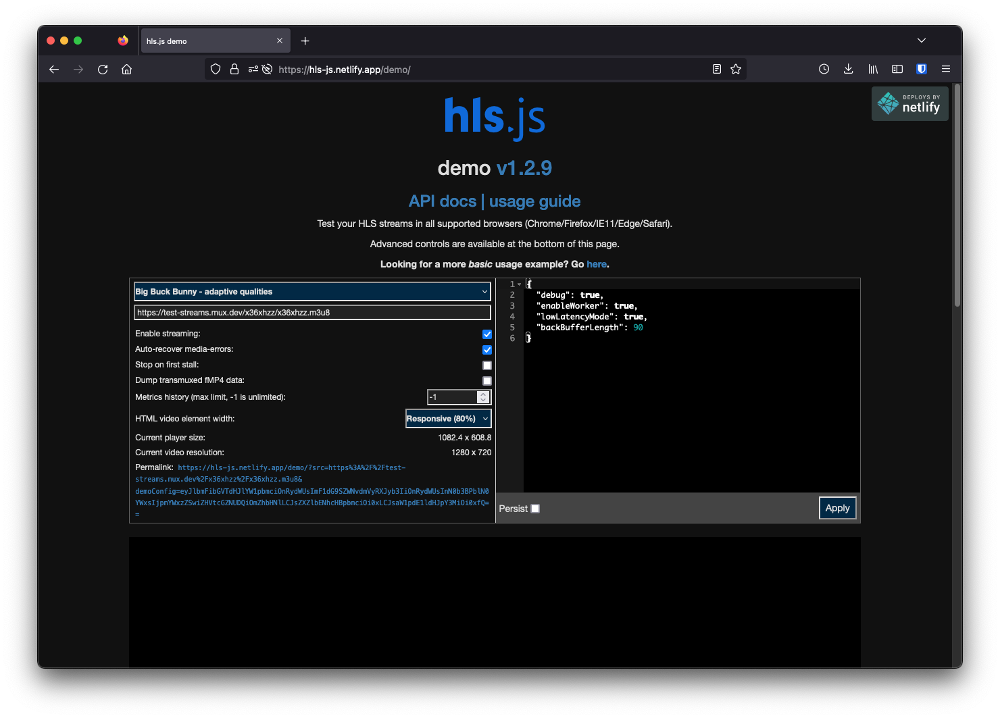
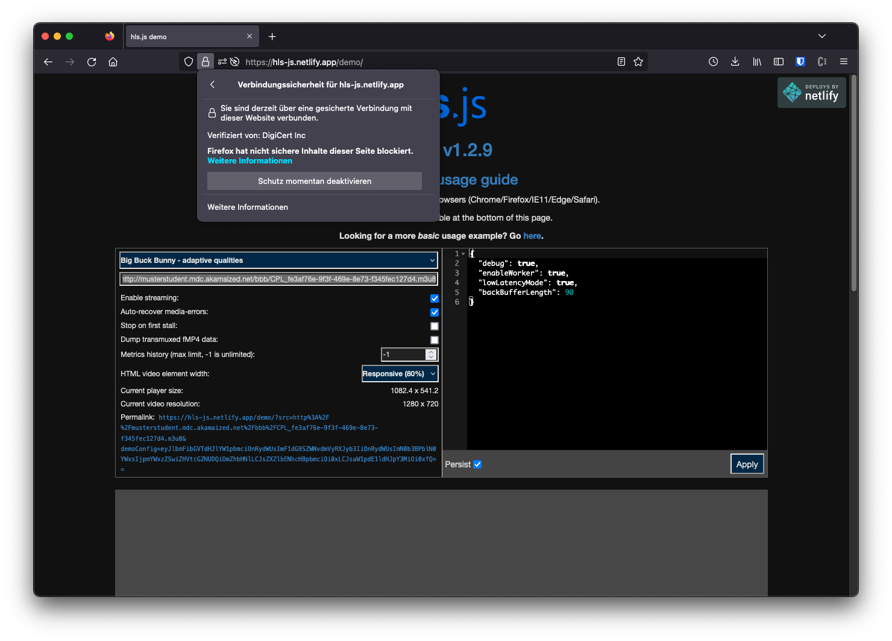
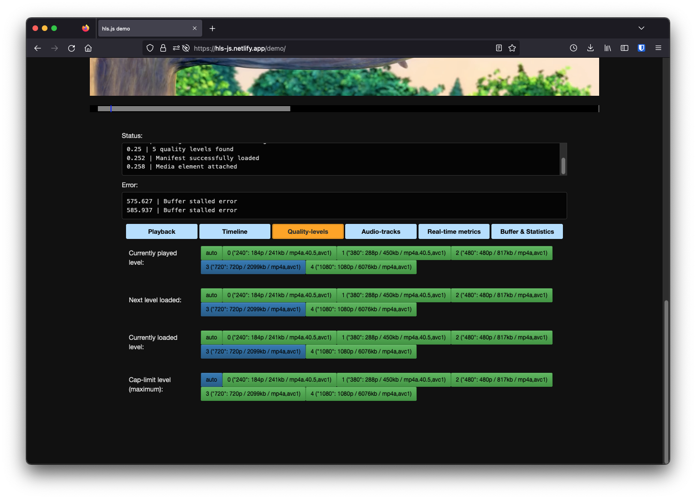
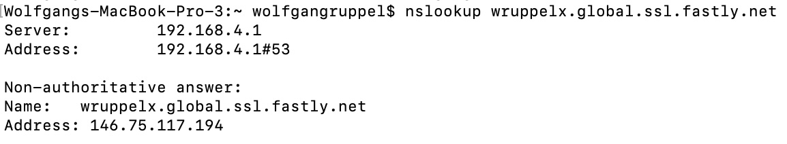
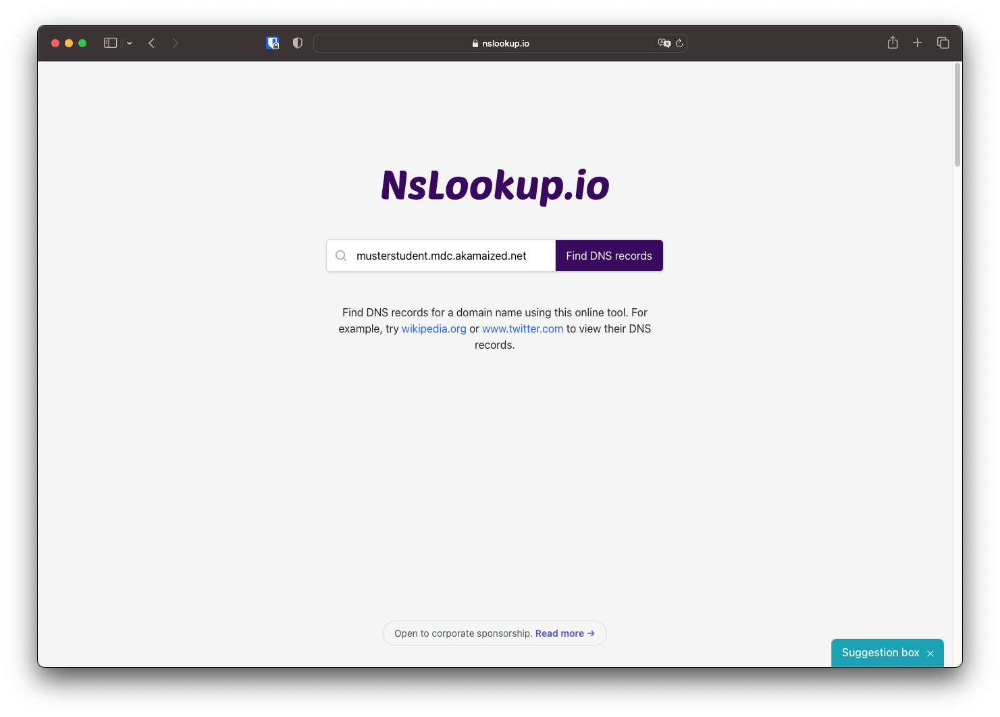
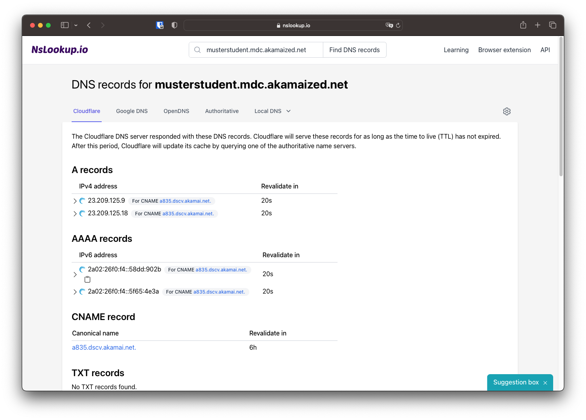
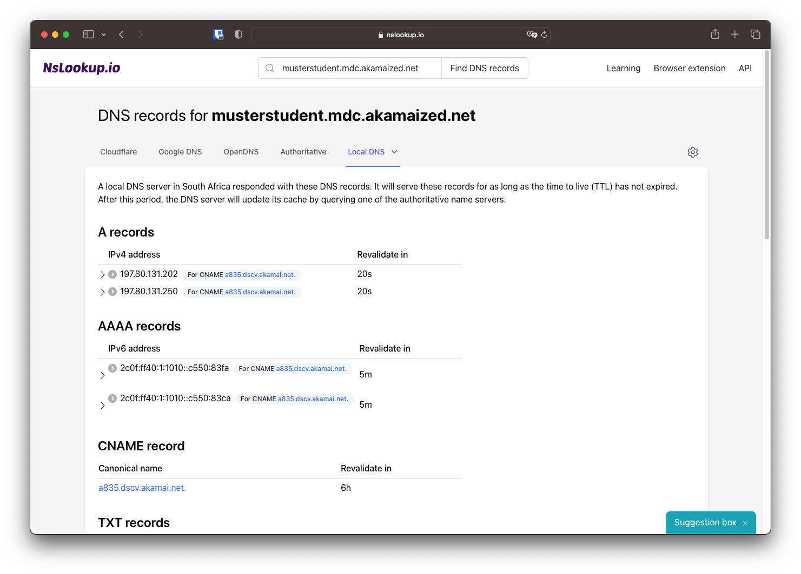

# Inhalte Abrufen

Die Inhalte sind nun über das CDN erreichbar. Der HLS-Stream kann damit öffentlich abgerufen werden. Um die Funktion des CDNs zu testen, soll im ersten Schritt kontrolliert werden, dass der HLS-Stream ordnungsgemäß abgerufen und in verschiedenen Qualitätsstufen wiedergegeben werden kann. Im zweiten Schritt soll kontrolliert werden, dass je nach geografischer Lage ein passender Edge Server im CDN gewählt wird und der DNS Eintrag auf diesen verweist.

## HLS-Player

Zum Testen der HLS-Funktionalität soll die Demo-Instanz von hls.js genutzt werden. hls.js ist eine quelloffene JavaScript Bibliothek, die HLS-Streams im Browser wiedergeben kann. Der Demoplayer ist unter [https://hlsjs.video-dev.org/demo/](https://hlsjs.video-dev.org/demo/) zu finden.

!!! warning "Kompatibilität"
    hls.js hat in der Vergangenheit auf Chrome (siehe Anleitung weiter unten), Edge und Safari funktioniert, auf Firefox gelegentlich nicht. Bitte testen Sie bei Problemen einen anderen Browser.




Standardmäßig ist in der Wiedergabe-URL ein Testvideo eingetragen. Hier soll die Fastly-URL der `.m3u8`-Datei ohne ein Qualitätssufix wie `_720p` eingetragen werden. Die URL besteht aus der Basis-URL (`https://<HDS Nutzer>.global.ssl.fastly.net`) und dem Pfad zur entsprechenden HLS-Playlist-Datei.

!!! question "Frage 2.4"
    Wie lautet die URL zum Abruf des Streams in Ihrem Ordner `/export/versuch2-hls-test/` ?
    Warum ist die Angbe des Unterordners `/export` nicht erforderlich?
    Dokumentieren Sie den erfolgreichen Abruf des Streams mit einem Player (z.B. VLC) mit einem Screenshot.


### ⚠️ Wichtiger Hinweis zum Abspielen ⚠️

Der hls.js-Demo-Player wird von einer anderen Domain geladen als der HLS-Stream.
Dadurch greift im Browser die Same-Origin-Policy, was ohne zusätzliche Maßnahmen dazu führt, dass:

- das Manifest geladen wird

- die Segment-Dateien jedoch blockiert werden

- die Wiedergabe fehlschlägt (manifestLoadError, levelLoadError)

**Lösung: Chrome mit CORS-Browser-Extension**

Für diesen Versuch ist die Verwendung einer CORS-Browser-Extension erforderlich und erlaubt.

**Installieren Sie die Extension über den Chrome-Store.**

https://chromewebstore.google.com/detail/allow-cors-access-control/lhobafahddgcelffkeicbaginigeejlf

**Wenn dies erfolgt ist kann nun das Plugin aktiviert werden, hierfür muss auf das Puzzlestück in Chrome gedrückt werden und auf das Corsplugin navigiert werden**


**Nun auf Toggle ON OFF drücken. Das PlugIn ist somit aktiviert**



### Abspielen

Mithilfe der Schaltflächen unter dem Abspielfenster können die Qualitätsstufen des Streams gewählt werden und Echtzeit-Statistiken des Video-Streams angezeigt werden



!!! question "Frage 2.5"
    Welche Qualitätsstufen sind im HLS-Stream enthalten? Geben Sie jeweils die vertikale Auflösung an.

## DNS

### nslookup

Zuerst soll die Namensauflösung innerhalb der Hochschule getestet werden. Dafür muss die Kommandozeile geöffnet werden und der Befehl `nslookup` ausgeführt werden. Als Argument des Befehls muss der Fastly Domainname angehängt werden:

```
nslookup <HDS Nutzer>.global.ssl.fastly.net
```



Im oberen Bereich wird der verwendete DNS-Server angezeigt. Dies ist in meinem Fall ein lokaler DNS-Server. Darunter werden die IP-Adressen zu dem aufgelösten Hostnamen angezeigt.

!!! question "Frage 2.6"
    Führen Sie den Befehl in der Hochschule aus. Fügen Sie einen Screenshot der Ausgabe in ihrem Versuchsbericht ein. Recherchieren Sie mithilfe einer GeoIP Webseite (z.B. [https://www.maxmind.com/en/geoip-demo](https://www.maxmind.com/en/geoip-demo)) den ungefähren Standort und Betreiber der gelisteten IP-Adressen.

    Falls Sie diesen Teil des Versuchs nicht in der Hochschule durchführen, notieren Sie im Bericht die Stadt, in der nslookup ausgeführt wurde.

### Online DNS Auflösung

Um zu sehen, ob die Namensauflösung einen nahen EdgeServer wählt, müsste normalerweise der geografische Standort verändert werden. Dies wäre beispielsweise mithilfe eines VPN-Anbieters möglich. Für diesen Versuch reicht jedoch eine Online DNS Namensauflösung.

Dazu soll die Webseite [https://www.nslookup.io/](https://www.nslookup.io/) verwendet werden. Hier kann der bei nslookup verwendete Hostname eingetragen werden und auf "Find DNS records" geklickt werden.



Ausgegeben werden die verschiedenen DNS-Einträge, die für diesen Hostnamen gefunden wurden. Hierbei wird standardmäßig der Cloudflare-DNS-Service verwendet.



Der Bereich "A records" zeigt die IPv4 Adressen des Hostnamen an und der Bereich "AAAA records" die IPv6 Einträge.

!!! question "Frage 2.7"
    Führen Sie eine GeoIP Abfrage durch. In welchem Land befinden sich die angezeigten IPs?

!!! question "Frage 2.8"
    Welche Bedeutung haben die CNAME-Werte neben den IPv4 und IPv6 Adressen? Beschreiben Sie, was CNAME ist und welche Rolle es in CDNs spielt.

#### Lokale DNS

Klicken Sie nun auf den Reiter "Local DNS" und wählen Sie Südafrika aus. Nun wird eine DNS-Abfrage aus Südafrika durchgeführt.



!!! question "Frage 2.9"
    Führen Sie eine GeoIP Abfrage durch. In welchem Land befinden sich die angezeigten IP? Was bedeutet dies für den Abruf des HLS-Streams aus Südafrika?