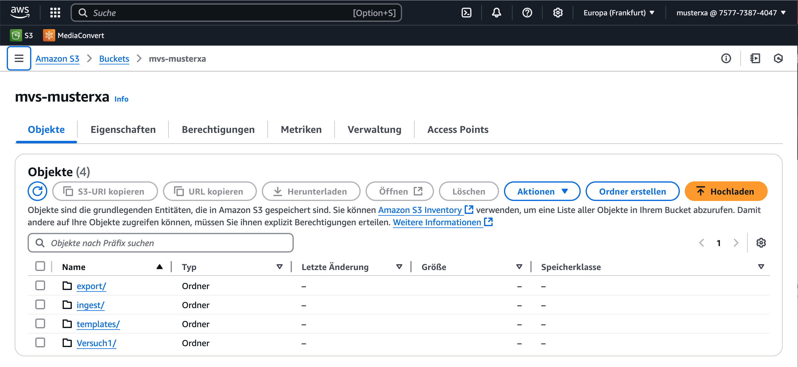
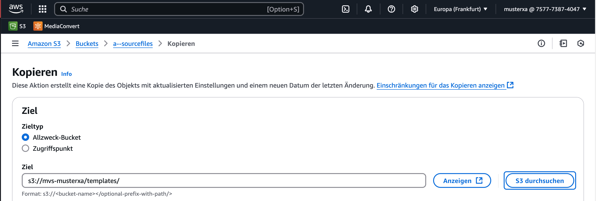

# S3 Vorbereitungen

Für diesen Versuch werden Unterordner im bereits vorhandenen S3 Bucket benötigt. Diese sollen die Namen `ingest`, `export` und `templates` tragen. In `ingest` sollen die zu transcodierenden Dateien abgelegt werden. `export` soll der Ausgabeordner für MediaConvert sein, von dem aus die Dateien via ftp zu Akamai hochgeladen werden. `templates` soll die Codierungseinstellungen enthalten.

## Unterordner erstellen

Um den Unterordner zu erstellen, muss auf der AWS Weboberfläche der entsprechende Bucket geöffent werden und über den Button "Ordner erstellen" erstellt werden.

Außer dem Ordnername müssen keine weiteren Einstellungen bei der Erstellung festgelegt werden.

Wiederholen Sie den Vorgang, bis alle drei Ordner erstellt sind.

## Transcodiervorlage hinzufügen

Für die automatische Transcodierung muss MediaConvert mitgeteilt werden, welche Transcodierparameter gewählt werden sollen. Dies geschieht über Vorlage im JSON-Format. Ein Beispiel für diese Vorlage steht in `a--sourcefiles` zur Verfügung und soll in den Ordner `templates` kopiert werden.

!!! question "Frage 1"
    Laden Sie die JSON Vorlage herunter und öffnen Sie diese in einem Texteditor. Welche Auflösungen werden durch diese Vorlage erzeugt? Welche durchschnittlichen und maximalen Video-Bitraten besitzen die Auflösungen jeweils?

Kontrollieren Sie, dass die Datei in das richtige Verzeichnis kopiert wurde.