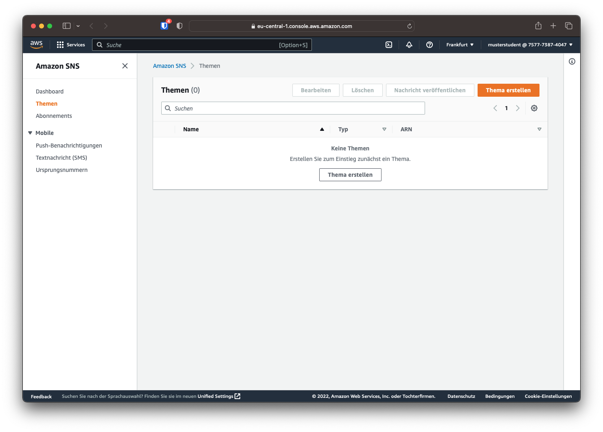
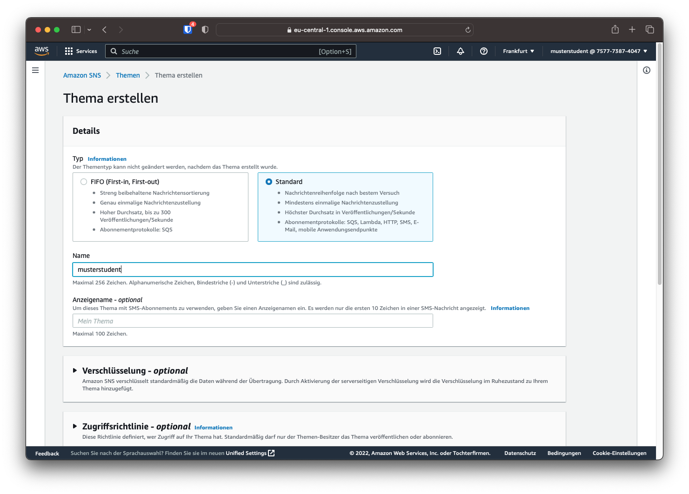
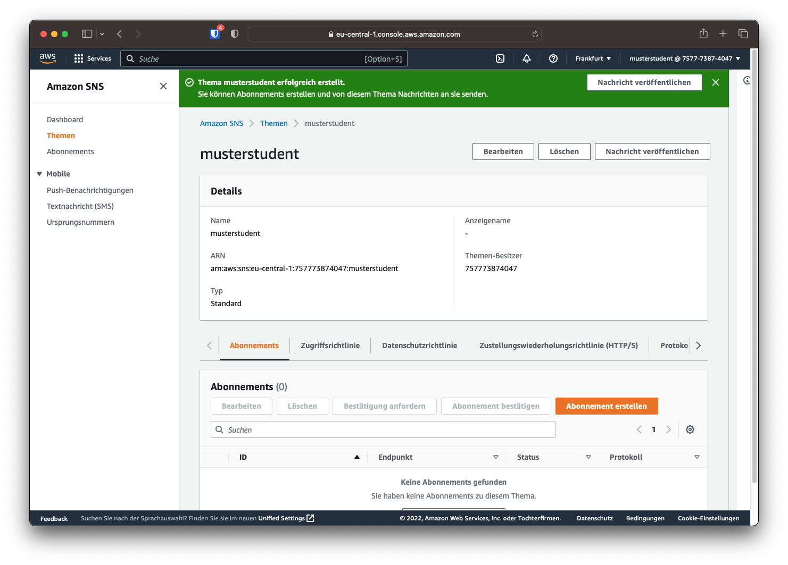
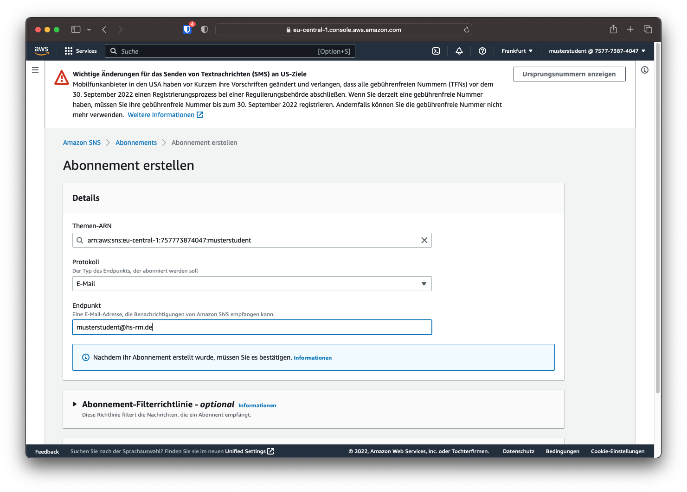
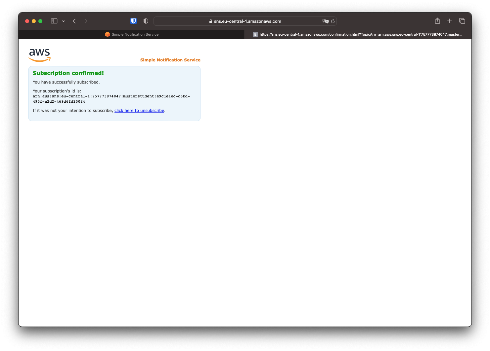

# SNS

Damit die Statusmeldungen per Mail versendet werden können muss ein Veröffentlichungs-Thema sowie erstellt werden. Diesem Thema kann danach ein Abbonement hinzugefügt werden um die Nachrichten per Mail empfangen zu können.

## Thema erstellen

Über die Suchleiste, kann die Startseite von SNS geöffnet werden. Hier lässt sich im linken Menü der Punkt "Themen" auswählen. Hier werden alle erstellten Themen angezeigt. Um eine neues Thema zu erstellen, kann rechts oben "Thema erstellen" gewählt werden.

Als Thementyp muss "Standard" ausgewählt werden. Als Name soll der HDS-Nutzername gewählt werden.

Ist das Thema erstellt, kann unten auf "Abonnement erstellen" ein Benachrichtigungskanal hinzugefügt werden. Hier muss als Protokoll "Email" sowie als Endpunkt die eigene Email Adresse gewählt werden.

Ist das Abonnement erstellt, wird eine Bestätigungsmail an die angegebene Adresse versendet. Über den Bestätigungslink muss das Abonnement bestätogt werden.

