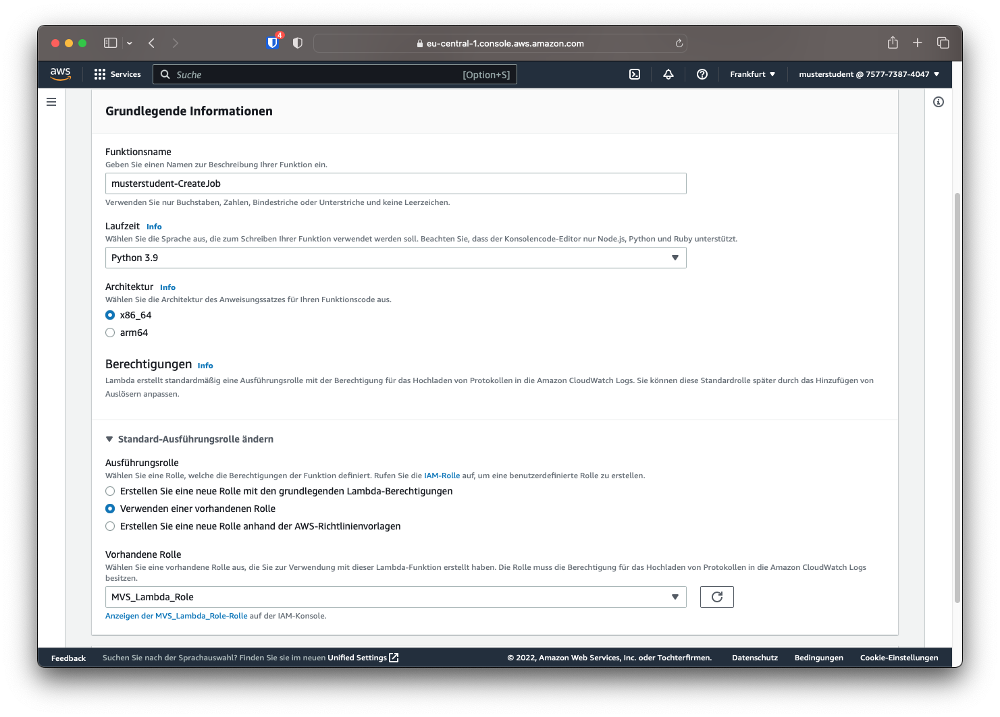
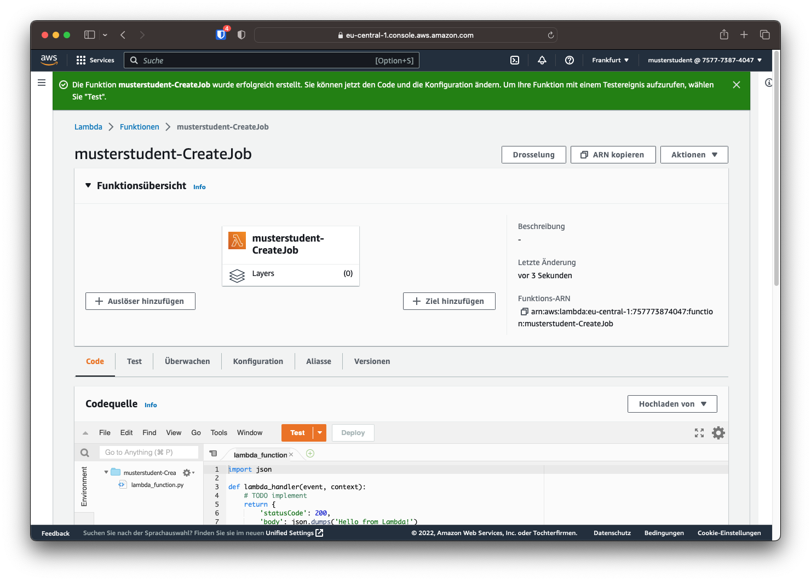
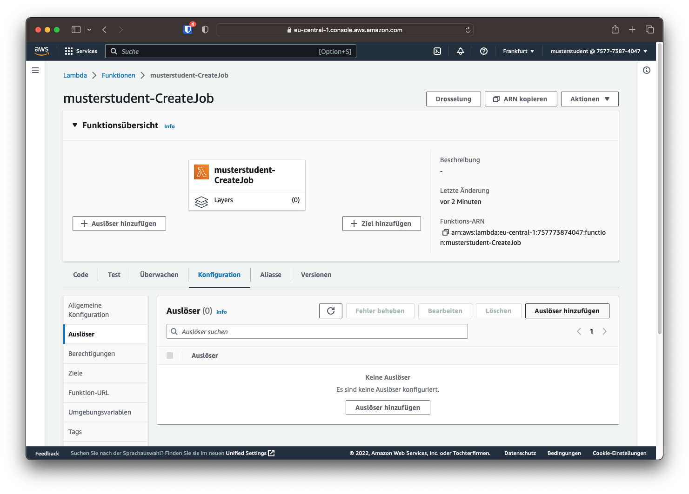
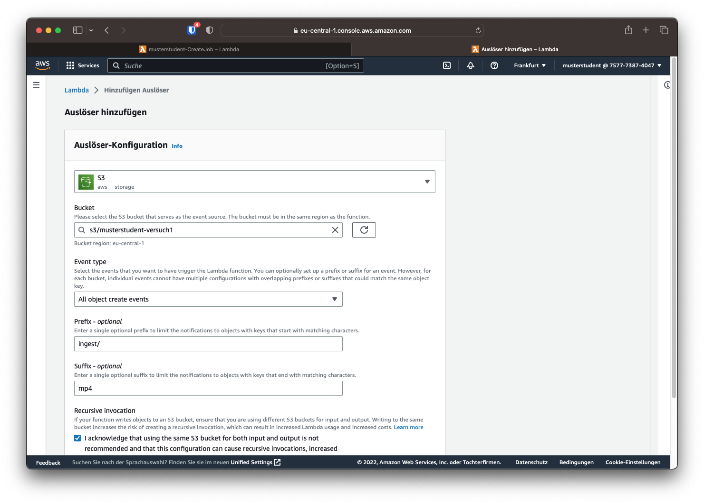
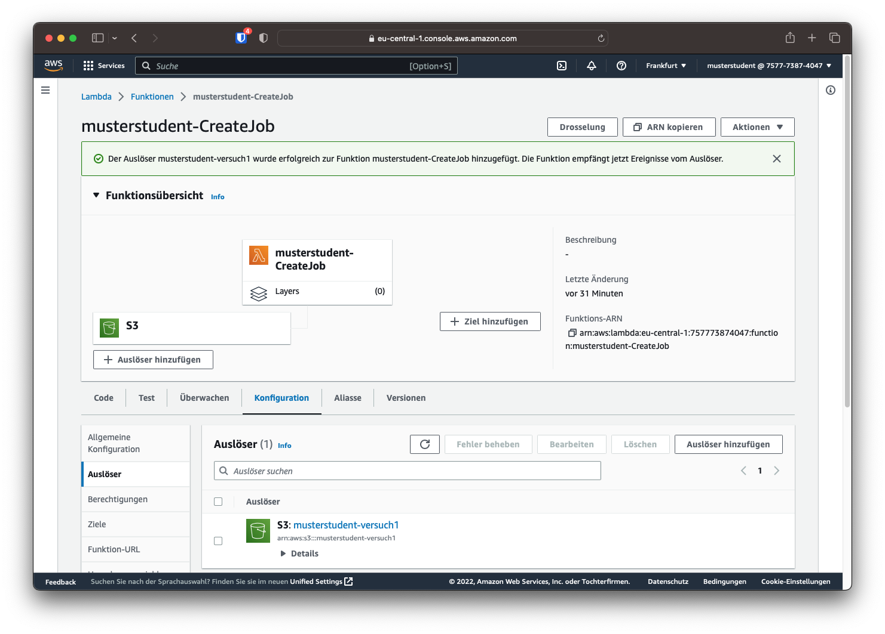
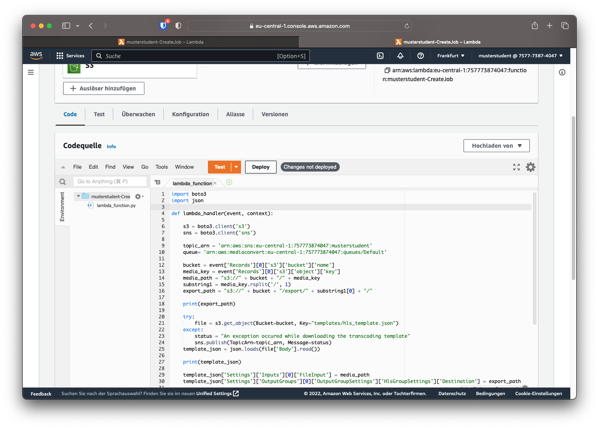
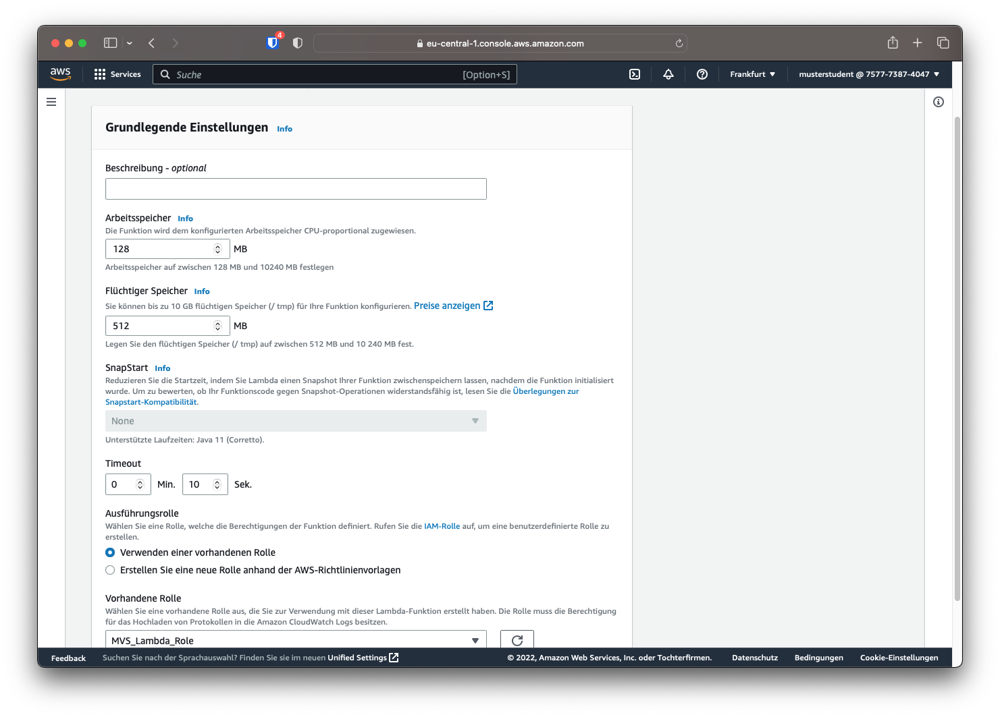
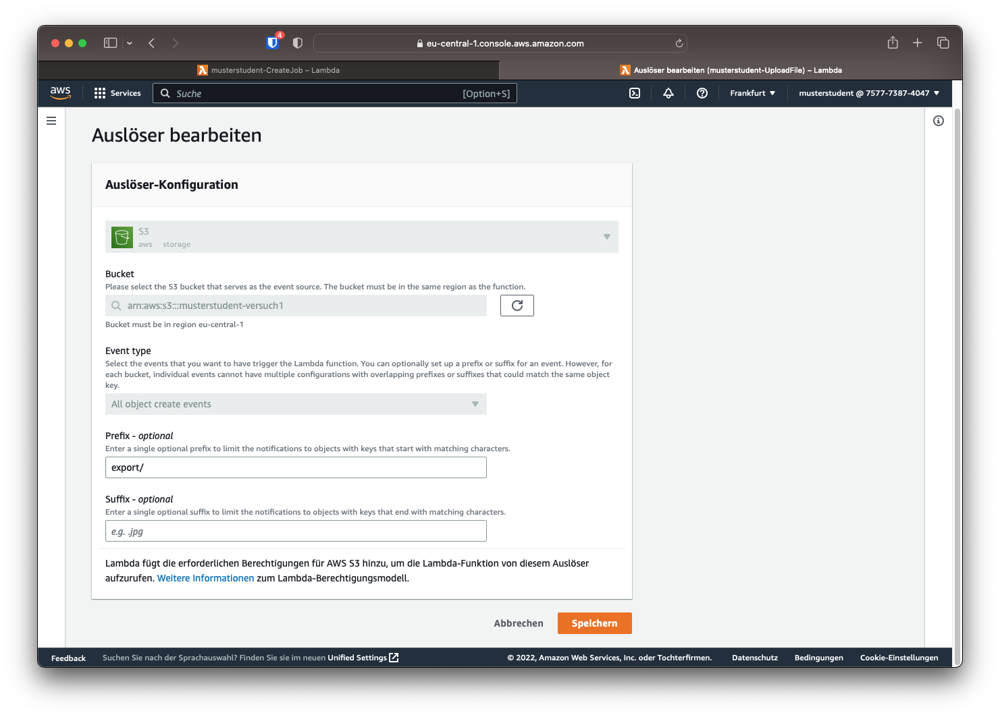

# Lambda

## Funktion 1: CreateJob

Die erste Funktion soll, wenn neue Dateien dem `ingest`-Ordner hinzugefügt werden, einen entsprechenden Transcodierauftrag erstellen und im Anschluss eine Statusmeldung via SNS versenden.

Dazu soll über das linke Menü der Punkt "Funktionen" angeklickt und auf der Übersicht der Funktionen auf "Funktion erstellen" klicken. Der Funktionsname soll folgendermaßen aufgebaut sein: `[HDS-Nutzername]-CreateJob`. Als Laufzeit soll Python gewählt werden. Im Unterpunkt "Standard-Ausführungsrolle ändern" soll die Option "Verwenden einer vorhandenen Rolle" gewählt werden und die bestehende Rolle "MVS_Lambda_Role" gewählt werden.



Sind die Infos eingetragen, kann auf "Funktion erstellen" geklickt werden, um die Funktion zu erstellen.



### Auslöser hinzufügen

Damit die Funktion beim Hinzufügen einer neuen Datei aufgerufen wird, muss ein Auslöser hinzugefügt werden. Dies kann über die Schaltfläche "Auslöser hinzufügen" oder im Reiter "Konfiguration -> Auslöser" geschehen.



Als Quelle soll S3 gewählt werden. Im Feld "Bucket" soll der eigene Bucket ausgewählt werden. Im Feld "Prefix" soll der Ingest-Ordner angegeben werden (also `ingest/`) und im Suffix "mp4". So wird die Funktion nur für hinzugefügte MP4-Dateien im Ordner "Ingest" aufgerufen. 

!!! warning "Kosten"
    **Zum Schluss muss noch Akzeptiert werden, dass wenn Funktionen das gleiche Output-Verzeichnis wie Input-Verzeichnis aufweisen, es schnell zu hohen Kosten durch rekursive Aufrufe kommen kann. Prüfen Sie daher immer, ob seperate Ein- und Ausgangsverzeichnisse angegeben sind.**



Ist der Auslöser erstellt, wird er oben in der Übersicht angezeigt.



!!! info
    Da es sich bei IMF-Paketen um ganze Ordner handelt, sind diese auch komplexer zu automatisieren. Um die grundlegenden Konzepte besser zu übermitteln, werden in diesem Versuch nur mp4-Dateien verwendet. Das gleiche lässt sich aber auch auf IMF-Pakete übertragen.

### Code

!!! question "Frage 2"
    Versehen Sie den Code mit Kommentaren, die die einzelnen Abschnitte und Befehle beschreiben. Es muss nicht zu jedem Befehl ein Kommentar geschrieben werden, dokumentieren Sie den Code aber so, dass die Funktionsweise ersichtlich wird. 
    
    Fügen Sie den kommentierten Code entweder als .py-Datei der Abgabe hinzu oder integrieren Sie den Code als Bild oder Text in den Bericht.

Im Nachfolgenden soll der Python-Code in die automatisch erstellte Datei "lambda_function.py" kopiert werden.

```
import boto3
import json

def lambda_handler(event, context):

    s3 = boto3.client('s3')
    sns = boto3.client('sns')

    topic_arn = 'xxxxxxxxx'
    queue= 'xxxxxxxxx'

    bucket = event['Records'][0]['s3']['bucket']['name']
    media_key = event['Records'][0]['s3']['object']['key']
    media_path = "s3://" + bucket + "/" + media_key
    substring1 = media_key.rsplit('/', 1)
    substring2 = substring1[1].rsplit('.', 1)
    export_path = "s3://" + bucket + "/export/" + substring2[0] + "/"
    username = bucket.replace("mvs-", "") + " - "

    try:
        file = s3.get_object(Bucket=bucket, Key="hls_template.json")
    except:
        status = "An exception occured while downloading the transcoding template"
        sns.publish(TopicArn=topic_arn, Message=status)
    template_json = json.loads(file['Body'].read())

    template_json['Settings']['Inputs'][0]['FileInput'] = media_path
    template_json['Settings']['OutputGroups'][0]['OutputGroupSettings']['HlsGroupSettings']['Destination'] = export_path

    for key in range(len(template_json['Settings']['OutputGroups'][0]['Outputs'])) : 
        template_json['Settings']['OutputGroups'][0]['Outputs'][key]['VideoDescription']['VideoPreprocessors'] = {}
        template_json['Settings']['OutputGroups'][0]['Outputs'][key]['VideoDescription']['VideoPreprocessors']['TimecodeBurnin'] = {}
        template_json['Settings']['OutputGroups'][0]['Outputs'][key]['VideoDescription']['VideoPreprocessors']['TimecodeBurnin']['FontSize'] = 16
        template_json['Settings']['OutputGroups'][0]['Outputs'][key]['VideoDescription']['VideoPreprocessors']['TimecodeBurnin']['Prefix'] = username
    template_json.update(template_json)

    mediaconvert = boto3.client('mediaconvert', region_name='eu-central-1', endpoint_url='https://yk2lhke4b.mediaconvert.eu-central-1.amazonaws.com')

    try:
        response = mediaconvert.create_job(
            Role="arn:aws:iam::757773874047:role/MediaConvert_Default_Role",
            Settings=template_json['Settings'],
            Queue=queue
        )
        status = "Transcoding Job created successfully. Job-ID: " + response['Job']['Id']
        sns.publish(TopicArn=topic_arn, Message=status)
    except:
        status = "An exception occured while creating the transcoding job"
        sns.publish(TopicArn=topic_arn, Message=status)

    print("Job-ID: " + response['Job']['Id'])
```

Damit die Transcoding-Aufträge in der richtigen Warteschlange landen und die Ergebnisse in das richtige SNS Thema veröffentlicht werden, müssen diese Punkte im Code modifiziert werden.

In Zeile 9 muss die topic_arn durch das eigene Thema aus SNS ersetzt werden. Die topic_arn findet man in der Themenübersicht in der Liste in der Spalte "ARN". In Zeile 10 muss außerdem die Warteschlange eingetragen werden. Dabei kann einfach "Default" durch die entsprechende Warteschlange ersetzt werden. Es soll die gleiche Warteschlange wie in Versuch 1 genutzt werden, die auch in der Mail mit den Zugangsdaten zu finden ist.

Ist der Code hinzugefügt und modifiziert, kann die Lambdafunktion mithilfe des Buttons "Deploy" aktualisiert werden.



### Weitere Einstellungen

Damit die Funktion reibungslos ablaufen kann, muss noch eine weitere Option geändert werden. Da die Erstellung des Auftrages und das Abrufen der Transcodiereinstellungen verhältnismäßig lang dauert, muss das Timeout der Funktion vergrößert werden. Das Timeout dient dazu, dass Funktionen sich nicht in Endlosschleifen verfangen und damit viel Geld kosten.

Im Reiter `Konfiguration -> Allgemeine Konfiguration` kann das Timeout geändert werden. Dazu klickt man auf "Bearbeiten" und wählt ein Timeout von 10 Sekunden. Dies sollte ausreichend sein, um die Funktion auszuführen (Die durchschnittliche Ausführungszeit liegt bei ca. 2,5 Sekunden).



## Funktion 2: UploadFiles

Die zweite Funktion soll bei neuen Dateien im Ordner `export/` die entsprechenden Dateien via FTP zu Akamai hochladen.

Die Lambda Funktion soll wie bei der ersten Funktion erstellt werden. Der Name soll sich diesmal wie folgt zusammengesetzt werden: `[HDS-Nutzername]-UploadFile`. Als Laufzeit soll wieder Python gewählt werden. Ebenso soll die Standard-Ausführungsrolle wie bei Funktion 1 geändert werden.

### Auslöser

Als Auslöser soll diesmal "export/" eingetragen werden. Die Suffix-Filterung kann leer gelassen werden.



### Code

!!! question "Frage 3"
    Versehen Sie den Code mit Kommentaren, die die einzelnen Abschnitte und Befehle beschreiben. Es muss nicht zu jedem Befehl ein Kommentar geschrieben werden, dokumentieren Sie den Code aber so, dass die Funktionsweise ersichtlich wird. 
    
    Fügen Sie den kommentierten Code entweder als .py-Datei der Abgabe hinzu oder integrieren Sie den Code als Bild oder Text in den Bericht.

Im Nachfolgenden soll der Python-Code in die automatisch erstellte Datei "lambda_function.py" kopiert werden.

```
import json
import os
import json
from ftplib import FTP
import boto3

FTP_HOST = 'mvs.ftp.upload.akamai.com'
FTP_USER = 'musterstudent'
FTP_PWD = 'xxxxxxxxxxxx'

ftp = FTP(FTP_HOST, FTP_USER, FTP_PWD)

s3_client = boto3.client('s3')

def lambda_handler(event, context):

    if event and event['Records']:
        for record in event['Records']:
            sourcebucket = record['s3']['bucket']['name']
            sourcekey = record['s3']['object']['key']

            ftp_path = sourcekey.replace("export/", "")
            ftp_folder = ftp_path.rsplit('/', 1)

            print(ftp_path)
            
            filename = os.path.basename(sourcekey)
            download_path = '/tmp/'+ filename
            print(download_path)
            s3_client.download_file(sourcebucket, sourcekey, download_path)
            
            os.chdir("/tmp/")
            with FTP(FTP_HOST, FTP_USER, FTP_PWD) as ftp, open(filename, 'rb') as file:
                if directory_exists(ftp_folder[0]) is False: 
                    ftp.mkd(ftp_folder[0])
                ftp.cwd(ftp_folder[0])
                ftp.storbinary(f'STOR {filename}', file)


            os.remove(filename)

# Check if directory exists (in current location)
def directory_exists(dir):
    filelist = []
    ftp.retrlines('LIST',filelist.append)
    for f in filelist:
        if f.split()[-1] == dir and f.upper().startswith('D'):
            return True
    return False
```

In Zeile 7 bis 9 müssen die Login-Daten für den Akamai ftp Origin Server eingetragen werden.

### Weitere Einstellungen

Sollen große Dateien hochgeladen werden, ist es unter Umständen nötig, das Timeout zu vergrößern. Außerdem muss bei großen Dateien die Größe des flüchtigen Speichers erhöht werden. Bei den kleinen Transport-Stream Dateien ist dies jedoch nicht nötig.