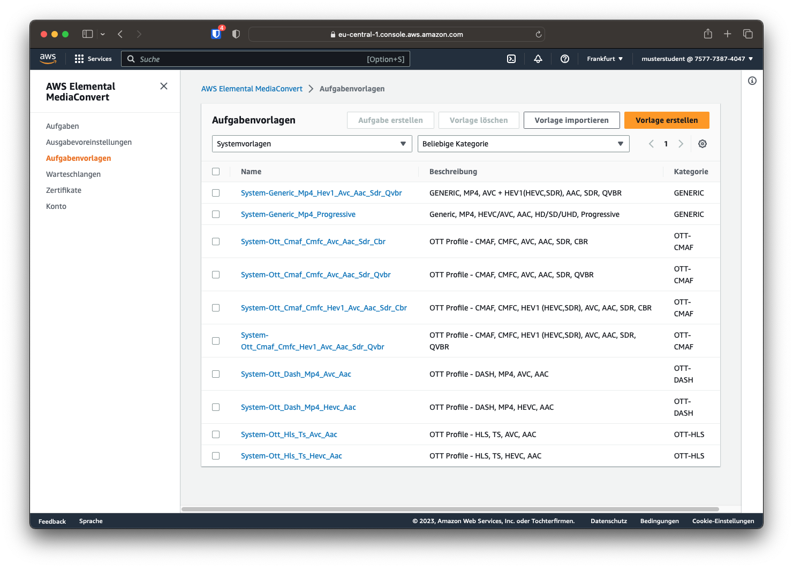
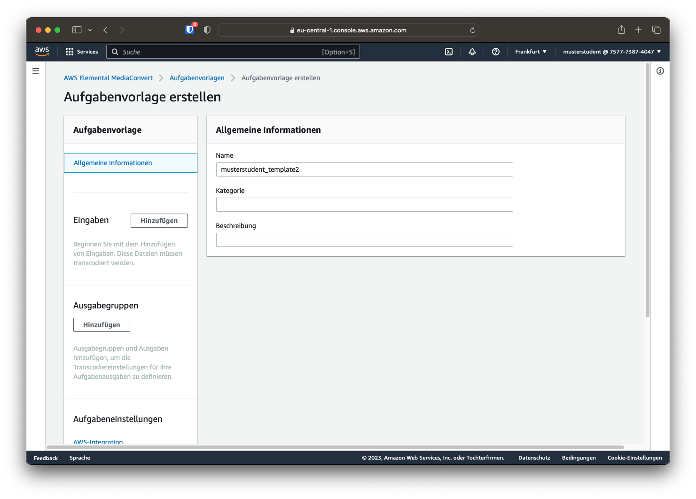
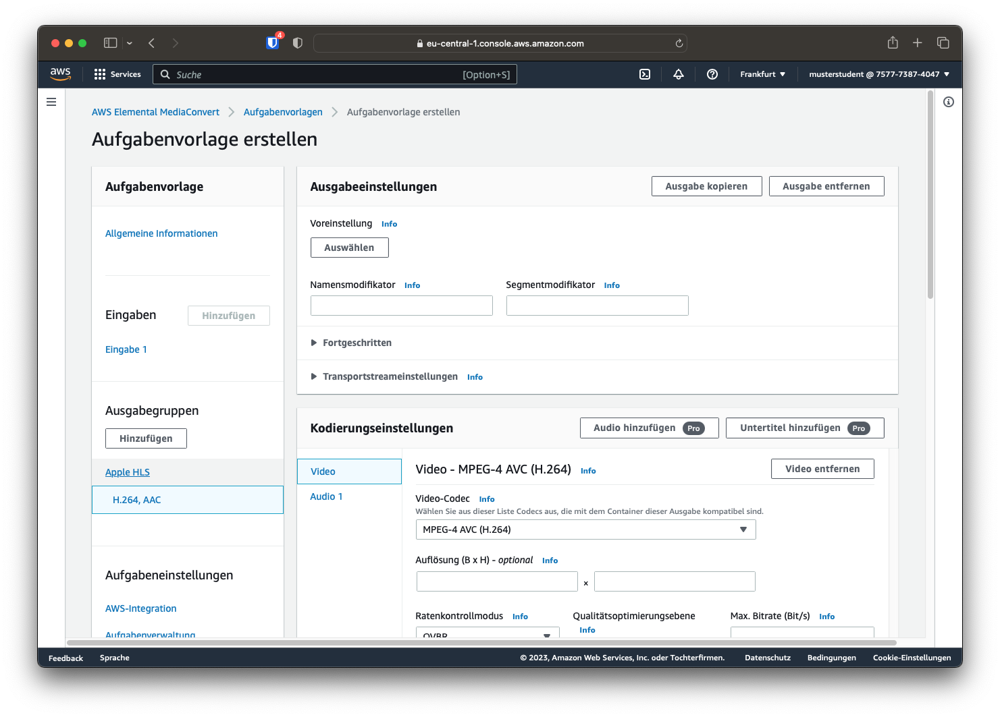
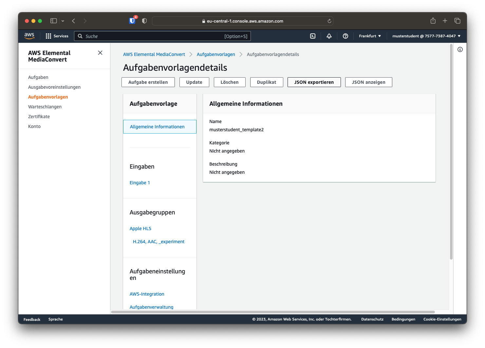

# Testen

## Test mit der erzeugten Transcodiervorlage
Um die automatische Transcodierung zu testen, soll eine Datei aus dem mp4-Bucket "a--sourcefiles" mithilfe der S3 Weboberfläche in den Ingestordner kopiert werden. Danach sollte automatisch ein neuer Transcodierauftrag bei MediaConvert gestartet werden.

Nach der Transcodierung kann auf dem FTP-Server nachgesehen werden, ob die Inhalte automatisch hochgeladen wurden. Das Abspielen kann wie in Versuch 2 mithilfe des HLS-Players geschehen.

## Status der Bearbeitung überprüfen
Der Status der Ausführung der Lambda-Funktionen kann über den AWS-Service CloudWatch verfolgt werden. Dort sind auch mögliche Fehlermeldungen sichtbar.
Über die Suchleiste den Service Cloudwatch auswählen. Unter "Protokolle" "Protokollgruppen" aufrufen. In der Übersicht sehen Sie Ihre Lambda-Funktionen. Durch Klick auf die jeweilige Funktion können Sie den Status der letzten Aufrufe abrufen.

## Eigene Transcodier-Vorlage

Eigene Transcodiervorlagen können in der Mediaconvert GUI erstellt werden. Dazu muss in Mediaconvert der Punkt "Aufgabenvorlagen" gewählt werden. Hier kann unter "Vorlage erstellen" eine eigene Vorlage erstellt werden.

Zuerst muss der Name der Vorlage gewählt werden. Hierbei soll wieder der eigene HDS-Nutzername als Präfix verwendet werden, sodass der Name der Vorlage folgendem Schema folgt: `musterstudent_template2`. Die Felder "Kategorie" und "Beschreibung" können leer gelassen werden.

Nun können unter "Eingaben" und "Ausgabegruppen" wie gewohnt die Transcodierungseinstellungen festgelegt werden.

!!! question "Frage 4"
    Wählen Sie eigene Transcodierungs-Einstellungen. Probieren Sie andere Codecs, Bitraten, Seitenverhältnisse oder Farbkorrekturen aus. Dabei sollen die gewählten Parameter beispielsweise auf bestimmte Geräte wie das eigene Handy zugeschnitten sein oder anderweitig von den bisherigen Transcodierungseinstellungen abweichen. Dokumentieren Sie im Bericht Ihre Wahl.

!!! info
    Das CDN wurde auf die Wiedergabe von HLS-Streams konfiguriert, daher sollte auch HLS als Ausgabeformat gewählt werden.

Sind alle Parameter festgelegt, kann die Vorlage mithilfe des Buttons "erstellen" erstellt werden. Danach kann über den Button "JSON exportieren" die entsprechen JSON-Datei erstellt und heruntergeladen werden.

Damit die neu erstellte Vorlage vom Workflow verwendet werden kann, muss die JSON-Datei im eigenen S3-Bucket in den Ordner "templates" hochgeladen werden. In der Lambda-Funktion, die für das Erstellen des Transcodierauftrages zuständig ist, muss nun nur noch der Pfad der Vorlagendatei auf die neue Datei angepasst werden.

Neu ingestierte Mediendateien sollten dann mithilfe der neuen Vorlage transcodiert werden.
