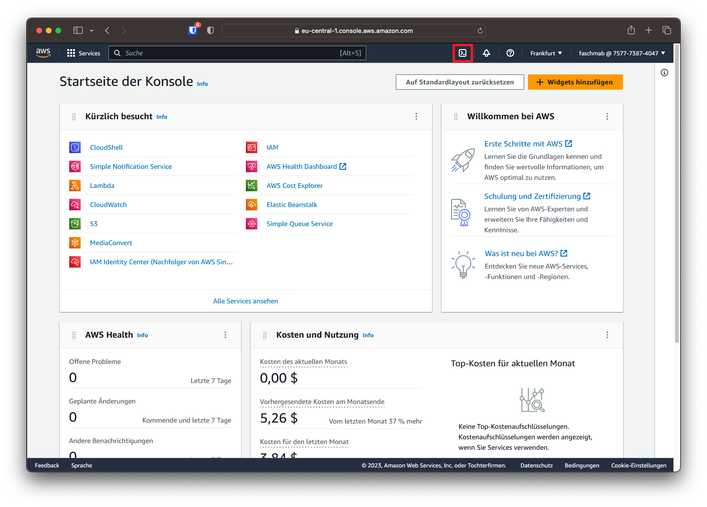
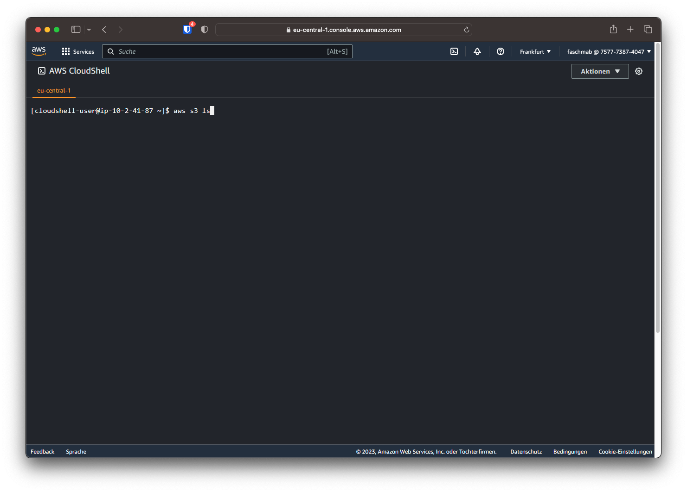

# AWS CloudShell

Die AWS CloudShell kann auf der Web-Konsole durch die Suchfunktion gefunden werden oder direkt mit dem Kommandozeilen-Symbol oben rechts gestartet werden.



## Kommando-Aufbau[^1]

Das AWS Kommandozeilen-Tool ist nach den einzelnen Produkten gegliedert. Der erste Befehl an die Kommandozeile gibt dabei das Produkt / den Service an. Nachfolgende Befehle werden auf diesem Service ausgeführt. Anschaulicher lässt sich dies mit Beispielen erklären:

```
aws s3 ls
```



Dabei ruft `aws` die AWS CLI auf, `s3` legt den Service, in diesem Fall AWS S3, fest und `ls` ist der auszuführende Befehl. Wie auch in Linux-Systemen steht `ls` für "list" und listet alle enthaltenen Elemente, in diesem Fall S3-Buckets auf.

!!! question "Frage 1"
    Führen Sie den oben angegebenen Befehl aus. Welche Buckets werden angezeigt. Dokumentieren Sie die Ausgabe mit einem Screenshot.

### Parameter

Um die Parameter eines Befehls anzupassen, wird wie bei anderen Kommandozeilenprogrammen verfahren. Soll eine Datei vom S3-Bucket auf die Cloudshell kopiert werden, kann dieser Befehl ausgeführt werden:

```
aws s3 cp s3://a--sourcefiles/hls_template.json . --dryrun
```

Bei diesem Befehl wird `cp`, also eine Kopieroperation, ausgeführt. Der S3-Pfad danach gibt die Quelldatei an. Danach wird mit "." der Zielpfad angegeben. Der Punkt bedeutet dabei, dass der Zielpfad der Ort ist, von dem der Befehl ausgeführt wird. Die Option `--dryrun` führt den Befehl nur "auf dem Trockenen", also ohne das wirkliche Kopieren der Datei aus. Auf der Kommandozeile werden trotzdem alle Statusmeldungen wie üblich ausgegeben.

Um zu überprüfen, ob eine Datei in die CloudShell kopiert wurde, kann der Befehl `ls` in der CloudShell ausgeführt werden (ohne `aws s3` davor). Dieser Befehl listet die Dateien im aktuellen Pfad der CloudShell auf.

!!! question "Frage 2"
    Führen Sie den "cp"-Befehl mit der Option "--dryrun" aus. Führen Sie danach den Befehl ohne die "--dryrun"-Option aus. Dokumentieren Sie die Änderungen und kontrollieren sie mit `ls`, ob die Datei in das Dateisystem der CloudShell kopiert wurde.

[^1]: [https://docs.aws.amazon.com/cli/latest/userguide/cli-usage-commandstructure.html](https://docs.aws.amazon.com/cli/latest/userguide/cli-usage-commandstructure.html)