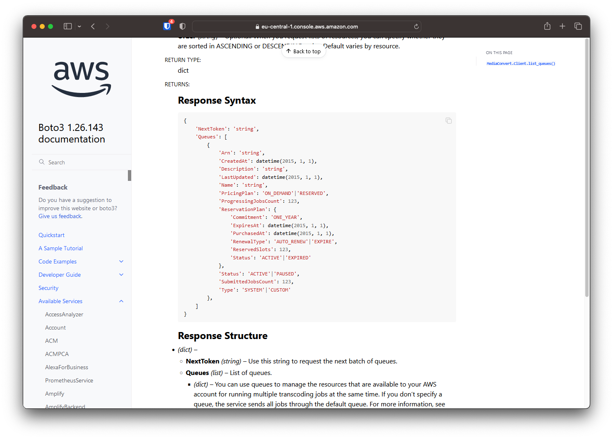
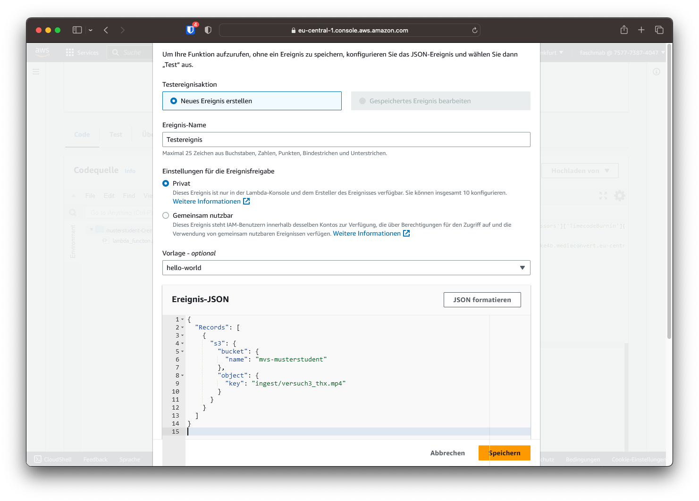

# Python SDK

Das Ausführen einzelner Befehle kann manche Aufgaben im Gegensatz zur Weboberfläche vereinfachen. Die Möglichkeiten der Automation werden jedoch erst durch Scripte ausgereizt. Neben Bash bietet Python einen guten Einstieg in die Scriptsprachen und bietet im Gegensatz zu Bash mehr Möglichkeiten. 

!!! info
    Damit bei der Erstellung der Nutzer für diese Übung nicht 20 Nutzernamen händisch eingetragen werden müssen, wurde für diese Aufgabe ein Script erstellt, welches die teilnehmenden Studierenden einliest, Nutzer und Passwörter erstellt und die nötigen Berechtigungen vergibt. Durch ein Akamai Python-Paket erstellt dieses Script ebenso die Nutzer in Akamai.

Im Folgenden sollen die bestehenden Python-Scripts in den Lambda-Funktionen um zusätzliche Funktionen durch das AWS Python SDK erweitert werden.

## Automatische Warteschlangen-Auswahl

Im ersten Schritt soll die Lambda-Funktion automatisch die optimale Warteschlange auswählen. Optimal bedeutet in diesem Falle, dass keine feste Warteschlange festgelegt wird, sondern immer die Warteschlange mit den wenigsten wartenden Transcoding-Jobs. Sollten mehrere Warteschlangen mit keinen wartenden Jobs existieren, soll möglichst eine Warteschlange ohne laufenden Job gewählt werden.

Mithilfe der Funktion `list_queues` können die Eigenschaften der Warteschlangen abgefragt werden. In der [Dokumentation](https://boto3.amazonaws.com/v1/documentation/api/latest/reference/services/mediaconvert/client/list_queues.html) ist nachzulesen, dass in der Antwort die Eigenschaften `ProgressingJobsCount` und `SubmittedJobsCount` sowie die Eigenschaft `Arn` übermittelt werden. Die ARN ist eine eindeutige Zeichenkette, die als Verweis zur Warteschlange dient und der Funktion `create_job` übergeben wird.



### Zusätzlichen Code einfügen

#### 1. Warteschlangen abrufen

Der folgende Code-Ausschnitt speichert die Liste der Warteschlangen in der Variable `response` und extrahiert daraus die Liste der Warteschlangen:

```
response = mediaconvert.list_queues()
queues = response['Queues']
```

#### 2. Warteschlangen sortieren

Um die Warteschlangen zu sortieren, soll die Funktion `sorted` verwendet werden. Dieser Funktion können folgende Parameter übergeben werden:

- `iterable` / Eine Liste (oder andere Form von aneinandergereihte Daten), die sortiert werden sollen
- `key` / Eine individuelle Sortier-Funktion (optional)
- `reverse` / Wenn auf `True` gesetzt wird in umgekehrter Reihenfolge (Absteigend) sortiert.

```
sorted_queues = sorted(queues, key=SORTING_KEY)
```

Als Key soll folgende Struktur genutzt werden:

```
lambda q: (q['Key1'], q['key2'])
```

Dabei sind `Key1` und `Key2` die Eigenschaften der Warteschlange, anhand der sortiert werden soll. Die Liste wird erst anhand von Key1 und danach anhand von Key2 sortiert. 

#### 3. Warteschlange zuweisen

Um die Warteschlange dem Transcoding-Job zuzuweisen, kann die Variable `queue` mit der ARN der am höchsten stehenden Warteschlange überschrieben werden.

```
queue = sorted_queues[0]['Arn']
```

!!! question "Frage 3"
    Implementieren Sie den zusätzlichen Code in Ihre "CreateJob" Lambdafunktion aus Versuch 3. Der Code soll nach `mediaconvert = boto3.client` eingesetzt werden. Ersetzen Sie `Key1` und `Key2` durch die Suchkriterien. Die genaue Schreibweise der Eigenschaften einer Warteschlange kann auch im "Response Syntax" der [Boto3 Dokumentation](https://boto3.amazonaws.com/v1/documentation/api/latest/reference/services/mediaconvert/client/list_queues.html) nachgelesen werden.

    Dokumentieren und kommentieren Sie den eingesetzten Code im Bericht.

### Funktion testen

Durch Hinzufügen einer Datei in den bereits bekannten "Ingest"-Ordner wird die Lambdafunktion automatisch ausgeführt. Nun soll die Funktion jedoch manuell getestet werden, um Fehler frühzeitig zu erkennen. Dies kann über den Button "Test" geschehen. Wurde noch kein Testereignis erstellt, öffnet sich die Eingabemaske, um ein neues Testereignis zu erstellen.

Der Ereignis-Name kann frei festgelegt werden. Nun muss noch die Ereignis-JSON geändert werden. Diese wird der Lambdafunktion auch bei automatischer Ausführung übergeben und beschreibt, wodurch die Funktion ausgelöst wurde. Im Falle einer neuen Datei z.B. den Pfad, die Größe und vieles mehr.

Damit die Funktion testweise durch eine bestehende Datei ausgelöst wird, muss die Ereignis-JSON wie folgt aussehen:

```
{
  "Records": [
    {
      "s3": {
        "bucket": {
          "name": "mvs-musterstudent"
        },
        "object": {
          "key": "ingest/versuch3_thx.mp4"
        }
      }
    }
  ]
}
```

Der Name des Buckets sowie der Key der Datei muss individuell abgeändert werden.

!!! warning "Warnung"
    Die Datei muss auch wirklich unter dem eingetragenen Pfad zu finden sein. Sehen Sie daher vorher in einem zweiten Tab im S3 Bucket nach, welche Dateien in Ihrem Bucket vorhanden sind.



Ist das Testereignis erstellt, kann es über den Test-Button ausgelöst werden.

!!! question "Frage 4"
    Lösen Sie das Testereignis aus und dokumentieren Sie das Ergebnis. Im Bereich "Function Logs" wird die Job-ID und die verwendete Warteschlange angezeigt.

### Volle Warteschlangen simulieren

Die Warteschlangen sind unter Umständen zum Zeitpunkt des Tests nicht ausgelastet und es wurde die erste Warteschlange gewählt. Um ausgelastete Warteschlangen zu simulieren, kann die Liste der Warteschlangen manuell überschrieben werden. Dazu müssen zwischen `queues = response['Queues']` und `sorted_queues = sorted(...)` folgende Zeilen eingefügt werden:

```
json_string = '[{"Arn": "arn:aws:mediaconvert:eu-central-1:757773874047:queues/Default", "Name": "Default", "PricingPlan": "ON_DEMAND", "ProgressingJobsCount": 1, "Status": "ACTIVE", "SubmittedJobsCount": 5, "Type": "SYSTEM"}, {"Arn": "arn:aws:mediaconvert:eu-central-1:757773874047:queues/Queue_01", "Name": "Queue_01", "PricingPlan": "ON_DEMAND", "ProgressingJobsCount": 1, "Status": "ACTIVE", "SubmittedJobsCount": 2, "Type": "CUSTOM"}, {"Arn": "arn:aws:mediaconvert:eu-central-1:757773874047:queues/Queue_02", "Name": "Queue_02", "PricingPlan": "ON_DEMAND", "ProgressingJobsCount": 1, "Status": "ACTIVE", "SubmittedJobsCount": 1, "Type": "CUSTOM"}, {"Arn": "arn:aws:mediaconvert:eu-central-1:757773874047:queues/Queue_03", "Name": "Queue_03", "PricingPlan": "ON_DEMAND", "ProgressingJobsCount": 1, "Status": "ACTIVE", "SubmittedJobsCount": 1, "Type": "CUSTOM"}, {"Arn": "arn:aws:mediaconvert:eu-central-1:757773874047:queues/Queue_04", "Name": "Queue_04", "PricingPlan": "ON_DEMAND", "ProgressingJobsCount": 0, "Status": "ACTIVE", "SubmittedJobsCount": 1, "Type": "CUSTOM"}, {"Arn": "arn:aws:mediaconvert:eu-central-1:757773874047:queues/Queue_05", "Name": "Queue_05", "PricingPlan": "ON_DEMAND", "ProgressingJobsCount": 1, "Status": "ACTIVE", "SubmittedJobsCount": 1, "Type": "CUSTOM"}, {"Arn": "arn:aws:mediaconvert:eu-central-1:757773874047:queues/Queue_06", "Name": "Queue_06", "PricingPlan": "ON_DEMAND", "ProgressingJobsCount": 1, "Status": "ACTIVE", "SubmittedJobsCount": 1, "Type": "CUSTOM"}, {"Arn": "arn:aws:mediaconvert:eu-central-1:757773874047:queues/Queue_07", "Name": "Queue_07", "PricingPlan": "ON_DEMAND", "ProgressingJobsCount": 1, "Status": "ACTIVE", "SubmittedJobsCount": 1, "Type": "CUSTOM"}, {"Arn": "arn:aws:mediaconvert:eu-central-1:757773874047:queues/Queue_08", "Name": "Queue_08", "PricingPlan": "ON_DEMAND", "ProgressingJobsCount": 1, "Status": "ACTIVE", "SubmittedJobsCount": 1, "Type": "CUSTOM"}, {"Arn": "arn:aws:mediaconvert:eu-central-1:757773874047:queues/Queue_09", "Name": "Queue_09", "PricingPlan": "ON_DEMAND", "ProgressingJobsCount": 1, "Status": "ACTIVE", "SubmittedJobsCount": 1, "Type": "CUSTOM"}]'
queues = json.loads(json_string)
```

Mit einem Klick auf "Deploy" können die Änderungen übernommen und der Test wiederholt gestartet werden.

!!! question "Frage 5"
    Dokumentieren Sie die Änderungen im Code und führen Sie den Test ein weiteres Mal aus. Welche Warteschlange wurde nun gewählt?