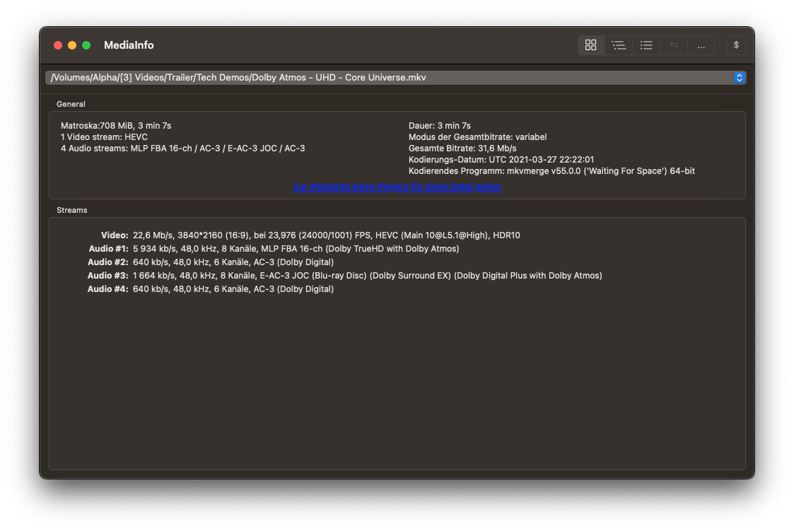

# Vorbereitung

## Abgabe

Bewertet wird ein schriftlicher Versuchsbericht, sowie die erstellten Ressourcen und Transkodier-Aufträge in AWS / Akamai. Der schriftliche Bericht sollte **grob 3 Seiten pro Versuch** umfassen und die in der Versuchsanleitung gestellten Fragen beantworten. Das Abgabedatum für die den Versuchsbericht ist der 09.01.2023. Die Fragen sind folgendermaßen gekennzeichnet:

!!! question "Beispielfrage n"
    Beispiel-Fragestellung.

## Software

Für die Versuche ist nur wenig Software auf dem lokalen Rechner von Nöten, da auf AWS und Akamai über ein Webinterface zugegriffen wird. Zur Beurteilung der Dateien sind jedoch einige Programme notwendig. 

Alle Programme sind sowohl für Windows und MacOS, als auch für diverse Linux-Distributionen erhältlich.

### Mediaplayer

Zur Wiedergabe von transcodierten Videodateien sollte ein aktueller Mediaplayer vorhanden sein, der `.mp4`-Dateien mit dem Codec `h.264` öffnen kann. Empfohlen wird der [VLC Mediaplayer](https://www.videolan.org/vlc/index.de.html).

### MediaInfo

Um die technischen Metadaten der Videodateien auszulesen, wird [MediaInfo](https://mediaarea.net/en/MediaInfo) benötigt.

